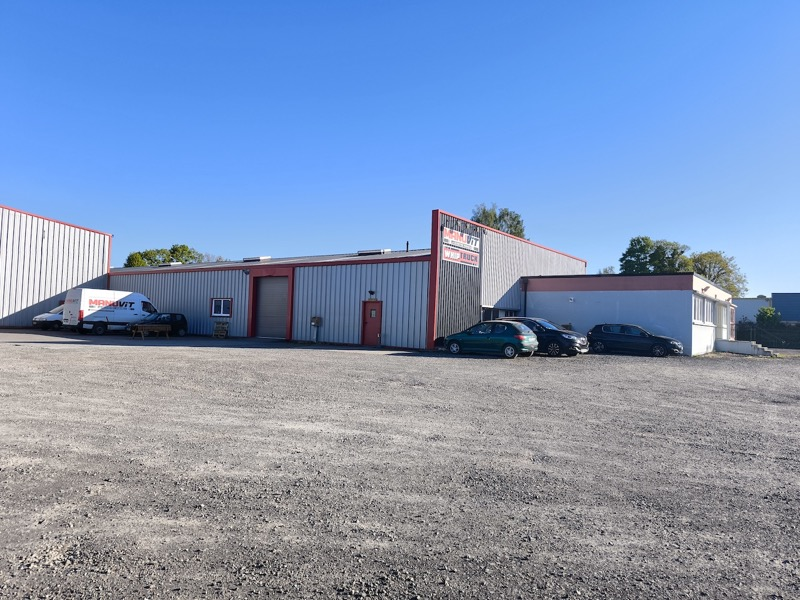

# 2026年 フランス出張報告

## 📅 概要
- **期間**: 2026年4月22日 〜 4月24日
- **訪問都市**: パリ近郊
- **目的**:代理店MANVITならびにIMSに訪問、それぞれの商品について協議

## 🇺🇸 MANUVIT
### 4月23日：パリから北西に２５０km
- **内容**: マブビット社を訪問。工場見学、ハンド及びKGLの説明、相手先商品の協議。
- **気づき**: 売上１０億円のうち、改造が６０％を占める。
　　　　　　　３DCADを使った設計力はなかなかのもの

### オフィス外観

### MANUVITでの改造

## 🇪🇺 ヨーロッパ（ロンドン・パリ）
### 4月8日：ロンドン視察
- **内容**: フィンテック企業とのミートアップに参加。
- **資料**: [リンク先のタイトル](ここにURL)

## 🎥 動画レポート（外部ストレージ）
- [サンフランシスコの街並み動画](GoogleドライブなどのURL)
- [現地カンファレンスの様子](YouTubeのURL)

## 📝 まとめ
今回の出張を通じて、今後のプロジェクトにおいて〇〇の重要性が高まると感じた。