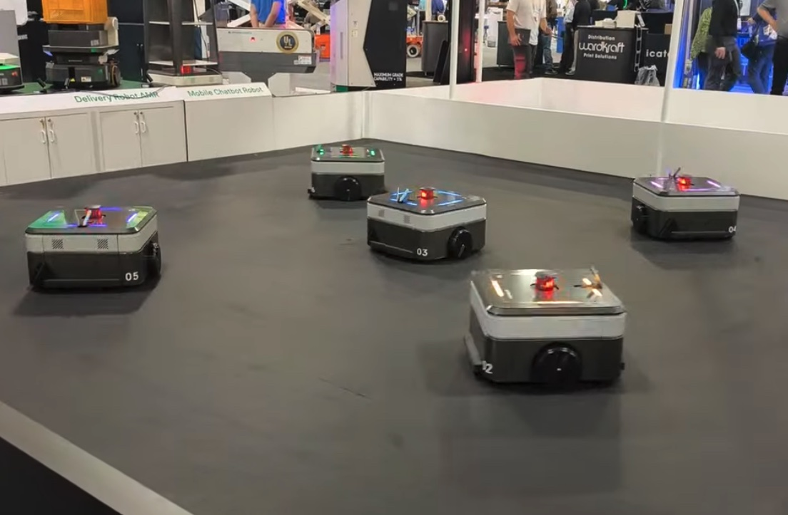
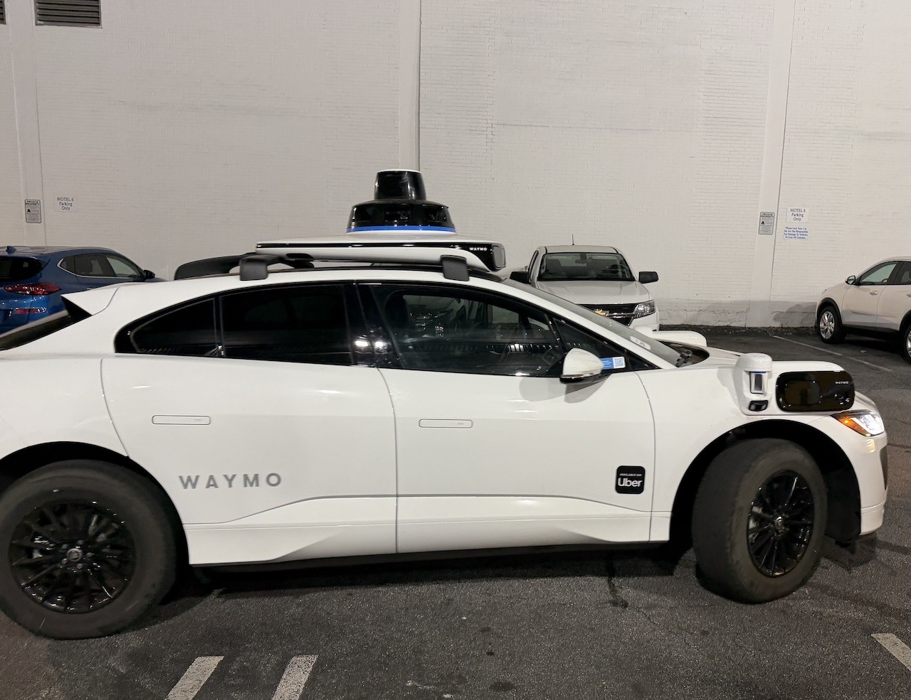

# 2026年 アメリカ出張報告

## 📅 概要
- **期間**: 2026年4月
- **訪問都市**: アトランタ（MODEX2026視察）、L.AのBIC
- **目的**: 最新技術の市場調査およびBICとの打ち合わせ

## 🇺🇸 アメリカ（アトランタ MODEX2026）
### 4：
- **内容**: MODEX2026視察
- **気づき**: 世界中（中国が多いが）のAMRメーカーが、最新テクノロジーを披露しており、驚かされた
 <!-- 写真を表示する書き方 -->

## 🇺🇸 アメリカ（アトランタ市内）
### 4：
- **内容**: Waymo自動運転タクシー
- **気づき**:  アトランタでは、既に当たり前として、無人運転タクシーが走っていた！！実際に乗車した
  <!-- 写真を表示する書き方 -->

一番の目的である、MODEXでの物流機器の視察
ビッグサイトなど、日本の展示会に足繁く通い、情報収集に努めているつもりであったが、
これまで耳にしたことのないメーカーが、たくさん出展していた

中国メーカーが多かったが、
アメリカ・ボストンや、オランダなど、欧米各国も革新的なものを出展していた

AMRは、他台数が、AIを使っていると思われる自律的制御で、
人混みの中をかき分けて行く、といったこれまでなら、当然に無理、と言われていた機能を実現させていた

いくつか、参考になるコンセプトも見つかった。

以下、Googleフォトを見て下さい。
先入観を持つことなく、何かを感じ取ってもらいたい
そして、新しい何かをクリエイトしてもらいたい

<!-- 
 -->

[Googleフォト：Yamaaki & Hashimoto の写真を見る](https://photos.app.goo.gl/1BJDr9B2urpYixX78)
