# Electric China 2025 出張報告（上海・天津）

> 作成日：2026-06-15　最終更新日：2026-07-10

> 期間：2025年4月15日（火）〜4月18日（金）
> 参加者：山崎（記入者）、奥村
> 目的：Electric China 2025（慕尼黑上海電子展／electronica China）の視察、天津マーケティングリサーチ、NIDECドライブ・テクノロジー（中国）工場見学
> 本報告書は、現地で記録した日報（`Nippou.txt`）の内容をそのままの構成・表現を基本としつつ、見出しによる整理と、写真・技術的考察・新商品開発への示唆を加えたものです。日報本文の事実・所感・評価は変更していません。山崎の記述を主軸に、各日「奥村視点」として奥村・前川の日報も統合しています。

---

## Day1：2025年4月15日（火） 上海到着・Electric China展示会初日

### 移動・到着

セントレアから2時間半で、上海浦東空港に到着。中国東方航空であったが、短いフライトの間にも美味しい機内食が提供されるなど、思いの外快適であった。

到着してからが長い。巨大な空港でとにかく歩く、エスカレーターで上がって下がって、地下鉄に乗ってようやくイミグレーションにて至る。

ガタガタと揺れの激しい、時速300キロのリニアに乗って約10分で展示会場の最寄駅に到着。ヨーロッパに比べれば、はるかに楽な道中であった。

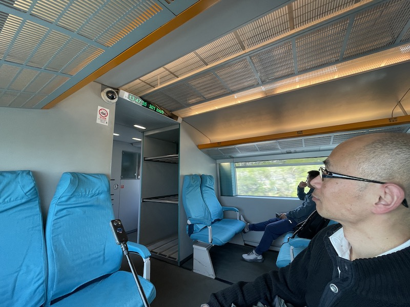 
*時速301kmを示すリニアの車内表示*

### 展示会場の下見

既に夕方であったが下見がてら、展示会場に入場した。半導体にまつわる会社が集まっている。出展企業はめちゃくちゃ多い。来場者も、とんでもなく多い。

 
*electronica China（慕尼黑上海電子展）の案内バナー。会期2025年4月15〜17日、Hall N1-N5・W3-W5館*

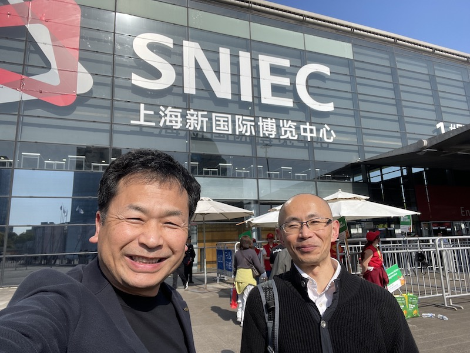 
*上海新国際博覧中心（SNIEC）入口にて*

全体の2割ほどを足早にみて回っただけであるが、パッと見て、知っている日本の会社は、日立、muRata、TDKくらい。

 
*会場内「人形机器人展示区（Humanoid Robot Exhibition Area）」*

 
*SEER（行启无界科技／INFINI Robotics）ブースの四脚ロボット*

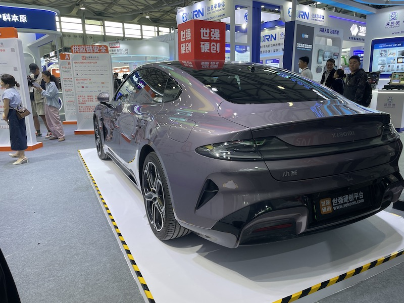 
*半導体企業ブースに併設展示されていたEV（小米／Xiaomi）*

ドイツでも感じたことであるが、これほどまでに、知らない会社が、派手に活躍しているのを見ると、自分の無知を思い知らされる。

半導体だけでこれほどの規模の展示会ということは、中国全体の経済がおして図られる。トランプ大統領が、あれほどまでにムキになるのもわかる、とてつもない脅威である。

外国人は少なかった。基本的には、中国国内で多くの取引が完結しているような印象を受けた。

EPほかの電動車メーカーも、上海近郊に拠点があり、当然にこうした半導体企業との交流もあるのであろう。以前、ノブリフトに訪問した時には、日本人の改善や、ヨーロッパ人のデザインの話もあった。足りない資源は、外部から調達している。

### 所感

同行している奥村くんは優秀ではあるが、技術レベルには限界がある。奥村くんと話をしていても、若手を育てると言っても、10年かけてモノになるかどうか、であろう。

自分としては、物流商品開発の方向性として岡目八目で、電動化からモーターの内製に向かっていくのが、一つの方向性では？と考えていたが、現状、かなり険しい道であると、感じさせられた展示会初日となった。

明日はじっくりと見てまわる予定。

> 激混みの、上海地下鉄2号線内より

### 奥村視点（Day1）

奥村もほぼ同じ行程・所感を日報に残している。

> 「フライト自体は2.5時間程度で短いのですが、浦東空港が広大で外に出るまでに時間を要しました。そのまま展示会場へ向い1時間程度ですがモータ制御に関連のありそうなエリアを見て回っています。モータドライブと言ってもモータ側ではなく基板側のドライバICやトランジスタの展示ばかりの印象です。アプリケーション例が想像した以上に少ないですが、何か新しい発見が出来るように明日から本格的にリサーチします。」（奥村）

> 「日本のインターネプコンもコロナ前は大盛況でしたが、それを上回る来場者とブースの豪華さを見ると中国の勢いを感じます。」（奥村）

日本国内最大級の電子部品展であるインターネプコンと比較しても規模・熱気で上回るという奥村の一次評価は、山崎の所感（「知らない会社が派手に活躍している」）を裏付けるものである。

 
*上海地下鉄2号線、ラッシュ時の車内*

 
*上海の夜景ポイントへ*

 
*上海蟹の有名店で、お店の人と記念撮影、みないい感じ*

 
*上海蟹ののった麺なんだけど、、、*

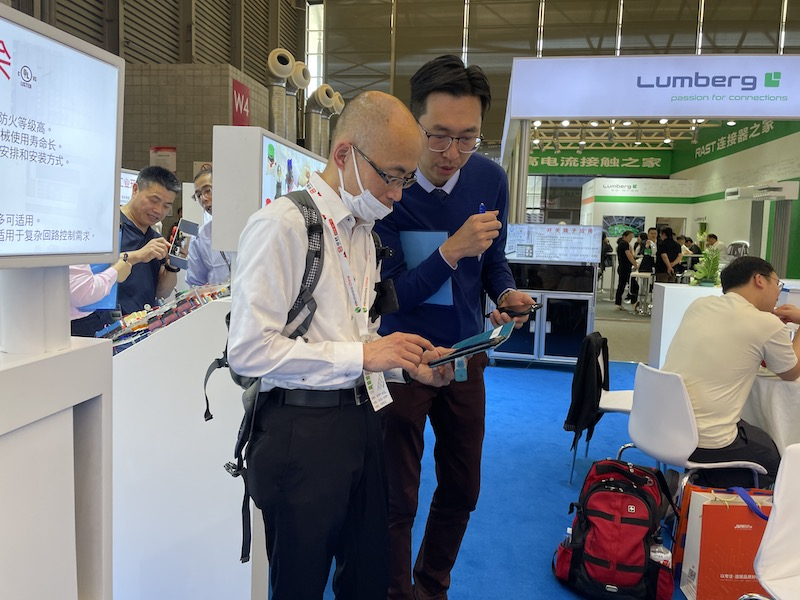 
*奥村さん、英語で仕様を尋ねてる*

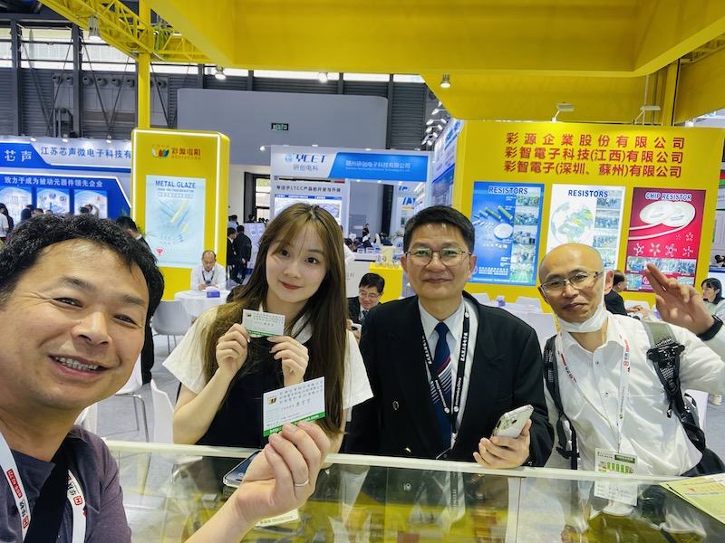 
*とにかくみんな、気が良くて、楽しくなってくる*

### 補足写真：移動（セントレア〜上海浦東空港）

 
*出発前、空港ラウンジで朝食。窓の外に滑走路が見える*

 
*ラウンジのビュッフェカウンター*

 
*搭乗橋の安全ネット越しに見える駐機中の中国東方航空機*

 
*搭乗中の機内通路、客室乗務員の姿*

 
*上海の環状湖・住宅開発地を機窓から*

 
*霞んだ農地・都市の格子状区画を機窓から*

 
*降下中、工業団地・農地を機窓から*

 
*滑走する中国東方航空の別機を機窓越しに*

 
*上海浦東空港ターミナルと駐機中の航空機群*

 
*着陸後、ターミナルビルへ誘導されるワイドボディ機*

 
*駐機中の中国東方航空機（A350）脇の地上クルーと貨物機材*

 
*ケータリングカーが機体にサービス中*

 
*「国際線・香港マカオ台湾到着」の案内サイン下を歩く*

 
*ターミナル通路のステンドグラス風アート*

 
*搭乗橋近くの地上支援用ラダー・スタンド*

 
*到着ロビーの乗り換え列車ホームにて*

 
*上海沿岸部を望む機窓、着陸態勢*

 
*中国聯通のSIM／データローミング設定完了を知らせるSMS*

### 補足写真：リニア〜会場入り

 
*リニアモーターカー車内、デジタル速度表示「300km/h」*

 
*「上海マグレブ・龍陽路駅」の案内サインとフロアマップ*

 
*プラットフォームで停車中のリニア車両脇を歩く乗客たち*

 
*駅構内の店舗・マクドナルド看板*

 
*マクドナルドのテーブルで食事を広げる*

 
*ハンバーガー・ナゲット・フライドポテトのトレイ*

 
*荷物とマクドナルドの食事一式を俯瞰*

 
*がらんとしたマクドナルド店内*

 
*地下鉄「龍陽路」駅の路線案内サイン*

 
*SNIEC（上海新国際博覧中心）入口前での記念撮影*

 
*SNIEC前広場、スターバックス・オフィスタワーを望む*

### 補足写真：Electric China展示会場にて（Day1）

 
*会場内、EV・ロボティクス関連の横断幕を背景に*

 
*半導体ブース（JRA・Dowa等）の通路にて*

 
*「Jason Electronics」「LIYI」ブースの資料を手に*

 
*SEER社「Humanoid Exhibition Area」の案内サイン*

 
*「世強硬創（Sertek）」ブースの紫色EVコンセプトカー*

 
*会場内、コンセプトカー展示ブース*

 
*「electronica China」歓迎バナー、出口付近*

 
*翻訳アプリで予約要否を確認*

### 補足写真：夕食・上海の夜（Day1）

 
*夜、ライトアップされたホテル（Novotel）の外観*

 
*紫にライトアップされた上海地下鉄駅構内*

 
*上海地下鉄の路線図パネル*

 
*外灘（バンド）の夜景、歴史的建造物のライトアップ*

 
*川越しに望む浦東の夜景スカイライン*

 
*浦東スカイラインを背にした記念撮影*

 
*上海蟹料理店の入口*

 
*店の女性スタッフとの記念撮影*

 
*テーブルの上のお茶とゆで落花生*

 
*現地ビールで乾杯*

 
*紐で縛られた上海蟹*

 
*3人での記念撮影、店内にて*

 
*テーブル越しに麺を食べる、店内風景*

 
*店のトイレ、タイル壁と男性用便器*

 
*装飾的な木製の玉座風トイレ*

 
*フォトウォール前での記念撮影*

 
*同じ3人、蟹料理の看板を背景に*

 
*買い物袋を提げて地下鉄・モール通路を歩く*

### 技術的考察

- **半導体・電子部品展示会としての規模そのものが、中国の電子部品サプライチェーンの集積度・自己完結度の高さを示している。** 出展企業・来場者ともに非常に多い一方で外国人が少ないという事実は、設計から部品調達、生産までの大部分が中国国内で完結する構造が既に確立していることを意味する。
- **「知らない会社が派手に活躍している」という所感は、部品レベル（基板・半導体・モジュール等）での技術力・コスト競争力において、無名でも世界的な供給力を持つ中国企業が多数存在することを示している。** 日本企業（日立、muRata、TDK等）はその中の一部にとどまる。
- **ロボティクス（人形機器人展示区、SEERの四脚ロボット等）の存在感は、AGV/AMR・サービスロボット領域の要素技術（センシング、駆動、制御）が、汎用部品の組み合わせとして実用段階に入っていることを示している。**
- **EVメーカー（小米／Xiaomi等）のブースが半導体企業の近接エリアに展開されていたことは、電動車の電動化・電子化が、自動車メーカー単独ではなく電子部品サプライチェーンと一体になって進んでいることを物語る。**

### 新商品開発への示唆

- **AGV/AMR**：人形机器人展示区やSEERの四脚ロボットなど、ロボティクス関連の出展密度の高さから、駆動部・センシング部の汎用部品調達先として中国サプライチェーンを継続的にウォッチする価値がある。
- **物流搬送機器・自動車整備リフト**：半導体企業の隣にEVメーカーのブースが並ぶ構図は、EVの電動化・電子化が車体構造（バッテリー搭載位置、配線・センサー類）に影響を与えることを示す。リフト・整備機器のEV対応設計（リフトアーム干渉、車体下部センサーへの配慮等）を検討する材料となる。
- **IoT／AI活用**：半導体・基板関連企業の集積は、当社のIoT機器（センサー、コントローラー基板）の部品調達・コストダウンの選択肢を広げる可能性がある。

---

## Day2：2025年4月16日（水） Electric China展示会2日目

奥村くんと2人で一通りめぐり終えた。

来る前、昨年の動画などから、モーターなどの展示があるものと考えていたが、全くなかった。海外展示会アルアルというものであろう。

目的のドライブユニットの観点から言えば、もう一つ下のレベルの、基板、トランジスタ、マイコン、抵抗、コンデンサ、など、の展示ばかりであった。

 
*防水加工済の基板・センサーモジュール等を展示するブース（H2O関連企業）*

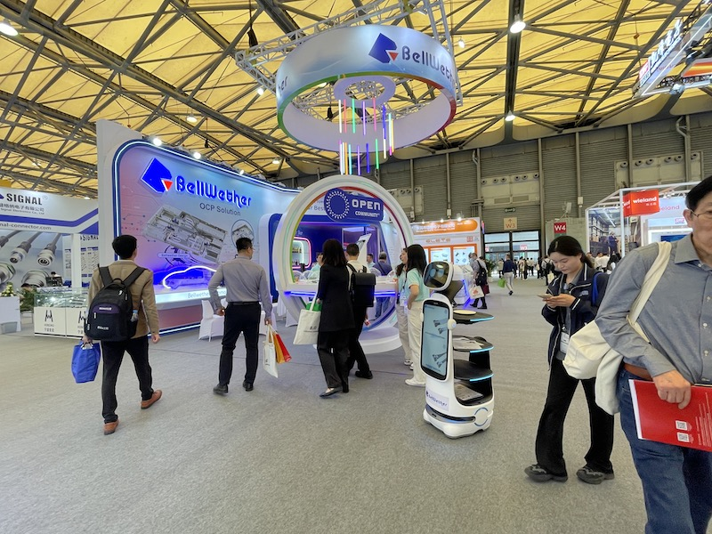 
*HTDisplay（北京華田信科電子）ブース。LCDモジュール等を展示*

 
*Bellweather（OCP Solution）ブース付近を巡回する搬送ロボット*

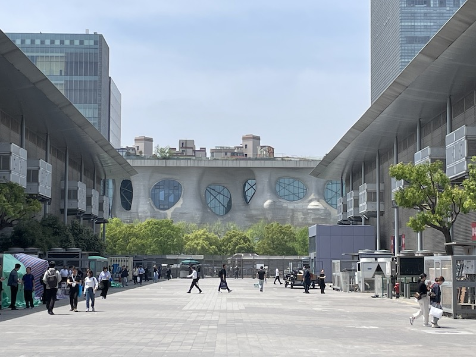 
*上海新国際博覧中心（SNIEC）の建物外観*

しかし、これらの要素部品を、地球的規模の集積地で、奥村くんと共に見学できたことは、とても良かった。

自分としては、初めてモーターを内製するイメージをリアリティを持つことが出来た。最低でも、月に100台以上の生産が必要となるが、そうした商品をマーケティングしていく、だけのこととも言える。

コントローラーも、この展示会に出されている部品で、製作出来るはず。この展示会の来場者の多くは、そういった心づもりなのであろう。彼らを見ていても、手が届かないほど優秀であるようには見えない。

奥村くんとここまで深く技術的な話が出来たのは、初めてのこと。もしも、当初考えていたようなニデック相当品が簡単に見つかってしまったら、こうした考えには至らなかった。

実際の進め方は、色々と考えられるが、最終的なイメージが浮かびつつあるように感じる。

明日は奥村くんとは別行動、知人のつてで、天津にまで足を伸ばし中国のリアルについてリサーチを行う。

> 上海虹橋空港第二ターミナル、国内線出発ロビーにて

### 奥村視点（Day2）

奥村は全8館を一通り見て回り、規模感を次のように記している。

> 「全8館ありますので、一通り全館を大雑把に見て回りました。全体の広さは東京ビッグサイト東館全体（1〜6ホール）の3倍強。大半がコネクタ、リレー、コンデンサ、抵抗といった部品類。よくもこんなに同じようなものを扱うメーカーがたくさんあってやっていけるものだと感心します。それだけ中国は世界の工場として裾野が広いのだと改めて実感しました。」（奥村）

駆動部品が見当たらないなか、奥村は自身の視察ミッションを次の2点に再設定している。

> 「①これまで見たこともない新しい技術に触れること　②将来電動車の生産台数が年間1000台、2000台になり、モータドライバまで内製するメリットが出たときに使える部品メーカーを見つけておくこと」（奥村）

Day2で特に印象的だった新技術として、2件を記録している。

 
*防水加工済の基板・センサーモジュール等を展示するブース（HZO社）*

> 「防水コーティング　基板などを防水するのは通常樹脂で固めますが、今日出会ったHZO社の技術は目に見えないほど薄い皮膜なのに完全な防水性能を得られるもの。商品を預かってこの会社が独自技術でコーティングして返す。楽天の電子Bookデバイスkoboがコーティングされて水槽に沈められていました。コーティングが薄いので見た目は全く分からずタッチパネルも正常に機能しており驚きました。」（奥村）

> 「TDKのARグラス　ARグラスは通常メガネのレンズ部分に映像を投影しますが、これはメガネをかけた人の網膜に直接レーザー光で映像を描画して目の前に画面が浮かんでいるように見えるもの。まだまだ粗削りで開発中ですが、視力に左右されず誰にでも使えるものになる商品とのこと。産業用途ではなく一般の人向けのデバイスで目の不自由な人を補助できるようなものにしたいとの説明でした。」（奥村）

これに対し前川からは次の返信があった。

> 「人口が日本の１０倍という中国では国内需要も多いということで、企業も多いということでしょうね。いろいろと写真も撮ってきてください。又、日本の企業の出展はありましたか？」（前川）

### 補足写真：ホテル周辺の朝（Day2）

 
*朝の渋滞、ホテル付近の広い通り*

 
*交差点を曲がる電気バス*

 
*シェアサイクルをバンに積み込むスタッフ*

 
*展示会エリア付近、路上に並ぶスクーター・原付*

 
*別の通り、百聯（Bailian）店舗前に並ぶスクーター*

 
*コンビニの飲料冷蔵ケース*

 
*コンビニの菓子売り場*

 
*セブンイレブンの冷蔵陳列棚*

 
*深圳レーザー産業展「Laserfair」の広告バナー*

 
*通路で立ち話をする様子*

 
*街路樹の並ぶ大通り、高層マンションと自転車レーン*

 
*交差点、消火栓と花の茂み*

 
*オフィス・商業複合施設外観、Shake Shackの看板*

### 補足写真：会場近くのモール（Day2朝）

 
*モール内、HONMAゴルフウェア店舗*

 
*モール通路、Hokaシューズ店舗前*

 
*NIOショールーム入口、ET7セダンとSUVを展示*

### 補足写真：Electric China展示会場にて（Day2）

 
*electronica China 2025入口ホール、案内サイン下に並ぶ来場者*

 
*MinCom（小銘工業互聯網）のPCBA／産業インターネットブース*

 
*HZO社ブース、水槽に沈めた基板をスタッフがデモ*

 
*同HZO社ブース、来場者が自分でコーティング基板をテスト*

 
*Ningbo RR Electricコネクタブースにて記念撮影*

 
*「E-Mobility Connectivity Solutions」の案内板、コネクタブース*

 
*EVスケートボードシャーシの展示*

 
*同シャーシ、Molexブースの看板を背景に*

 
*HARTINGブース、カムスイッチ製品を確認*

 
*CJT Connブース、テスラ・ファーウェイ・トヨタ等の取引先ロゴウォール*

### 補足写真：昼食・モール市場調査（Day2）

 
*昼食のレストランのメニューボード*

 
*同メニューボード、別の料理*

 
*レストランのカウンターで注文中*

 
*昼食トレイを俯瞰*

 
*通路を電動スーツケースで移動する様子*

 
*NISTRONICSブース全景*

 
*HTDisplay Electronics担当者との記念撮影*

 
*RVR/Pengke Electronicsブースで製品サンプルを確認*

 
*フードコートでアイスコーヒーを飲む同僚*

 
*モール内、ユニクロ店舗入口（市場調査）*

 
*ユニクロのポロシャツ陳列*

 
*ユニクロのAIRismTシャツ陳列*

 
*フードコートのレストランのメニューボード*

 
*潮州料理店のメニューボード*

 
*台湾料理店のメニューボード*

 
*フードコートで食事する客*

 
*モールアトリウム全景*

 
*同アトリウム、エスカレーター越しの角度*

### 補足写真：空港・天津の夜（Day2）

 
*空港モールのフードコート*

 
*空港チェックインホール、VIPクラブカウンター*

 
*麺屋の店主が調理中*

 
*食事トレイ俯瞰*

 
*空港内の上海ディズニーリゾートストア*

 
*ディズニーストア店内のぬいぐるみ棚*

 
*ミニーマウス塗装機のタラマック風景*

 
*トイストーリー塗装の別機*

 
*タラマックで階段から搭乗する乗客たち*

 
*夜、ターミナル窓から見えるケータリングトラック*

 
*天津空港、案内板前での記念撮影*

 
*天津地下鉄改札「Welcome to Tianjin Subway」*

 
*夜の天津、アーチ型高層ビルの街並み*

 
*夜の商店街、ファーウェイ・オニツカタイガー・アシックス*

 
*屋内アーケード、閉店後の静かな通路*

 
*カラオケ・バーにて*

 
*薄暗いバックヤード、放置されたおもちゃ類*

 
*賑わう夜市、屋台と歩行者*

 
*屋台の燻製肉・鴨肉トレイ*

 
*東北風冷麺の屋台*

 
*深夜の路上、清掃・積み込み作業*

 
*「天津市第一中学」のサインが入る高層建築の夜景*

### 技術的考察

- **「モーターそのものの展示は無く、一段下のレベルの部品（基板、トランジスタ、マイコン、抵抗、コンデンサ）の展示が中心だった」という事実は、中国の電子部品展示会のエコシステムが、完成品モーター・ドライブユニットよりも、それらを構成するコンポーネントの供給に強みを持つことを示している。** ドライブユニットは、それらの部品を「インテグレーション」することで成立する商品であるという見方が裏付けられた。
- **「最低でも月100台以上の生産が必要」という具体的な閾値が得られたことは大きい。** モーター内製の経済性を判断する上での出発点となる、現実的なロット規模の目安である。
- **「コントローラーもこの展示会の部品で製作できるはず」という所感は、制御基板の自社設計・小ロット生産が現実的な選択肢になり得ることを示している。**

### 新商品開発への示唆

- **AGV/AMR・物流搬送機器**：駆動ユニット（モーター＋コントローラー）の内製は、AGV/AMRや搬送機器の足回りコストダウンに直結する。確認できた部品サプライチェーン（基板、マイコン、抵抗、コンデンサ等）を用いたコントローラーの自社設計・試作を検討課題とする。
- **自動車整備リフト・階段昇降機**：モーター内製の議論は、リフトの昇降用モーターや階段昇降機の駆動ユニットにも横展開できる可能性がある。「月100台」という生産規模の閾値は、これら製品群の駆動ユニット内製化を検討する際の最初の判断基準として活用できる。
- **IoT／AI活用**：マイコン・基板レベルの部品が容易に入手可能な環境は、自社製IoTセンサーボードや状態監視ユニットの試作・量産コストを下げる機会となる。HZO社のナノコーティング防水技術は、屋外・悪環境対応のIoTセンサー（AGV/AMRの周辺機器、リフトの状態監視ユニット等）の防水対策として応用候補になる。

---

## Day3：2025年4月17日（木） 天津大学・天津マーケティングリサーチ

### 天津大学

知人のつてで潜入調査を実施。

優秀な学生への支援が素晴らし過ぎる。学生寮は、年間なんと1000元。学食は、一食20から30元。数十はあろうかという業者が、様々なメニューを提供する。信じられない高レベルの食事を提供している。

現在に至る中国の強さの根源を見た気がした。しかし色々な面で羨ましい。やり直したくなってくる。

一方では、天津大学を出ても就職出来ない者もいるとか。ハノイ大学とかでも同じ話を聞いたことがある。なるほど、色々と考えさせられる。

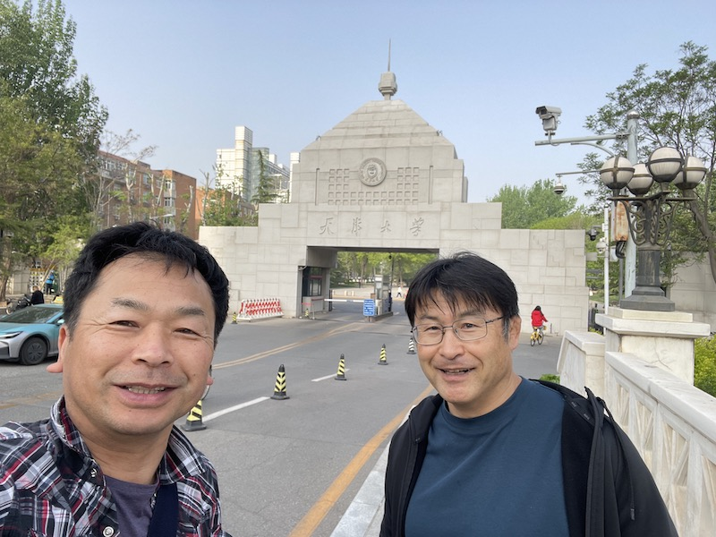 
*天津大学の正門前にて*

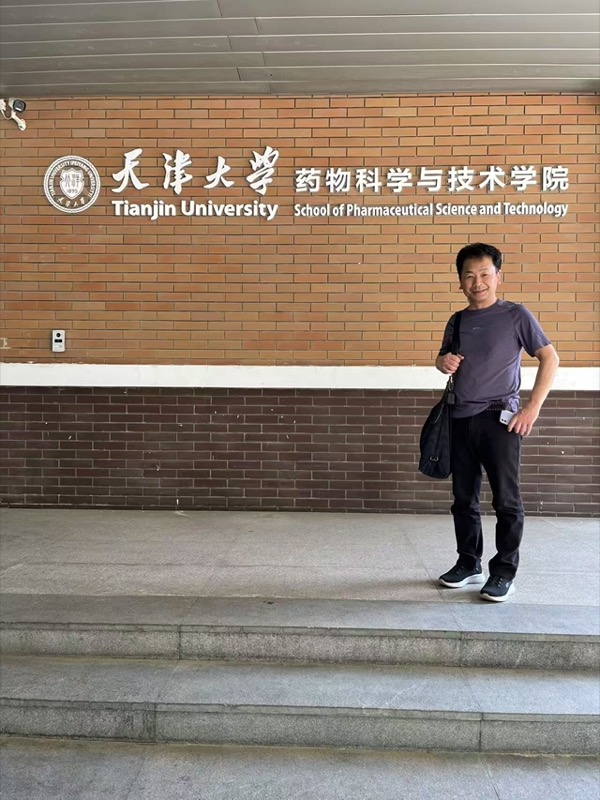 
*天津大学 科学棟*
### 天津マーケティングリサーチ

いまさら自分が言うのは、とても薄っぺらいが、中国の勢いは凄い。

それだけではなく、昔に比べたら少しお行儀よくなっている。あちこちにゴミが散乱していたり、交通ルールはメチャクチャだったり、満員の地下鉄に、我先など乗り込んできたり、といったことは依然としてあるにせよ、ショッピングモールや駅構内の洗練された雰囲気は、日本やドイツの上をいってしまっている。

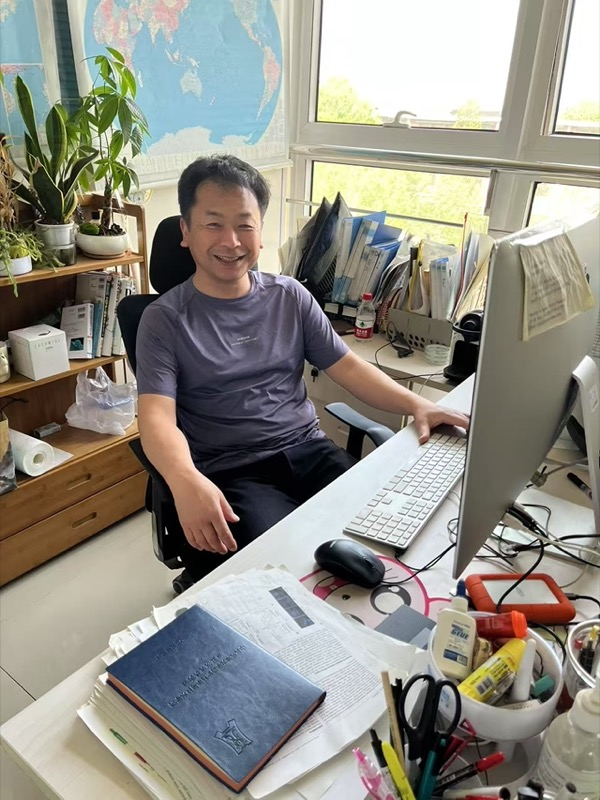 
*[天津大学の教授気分]*

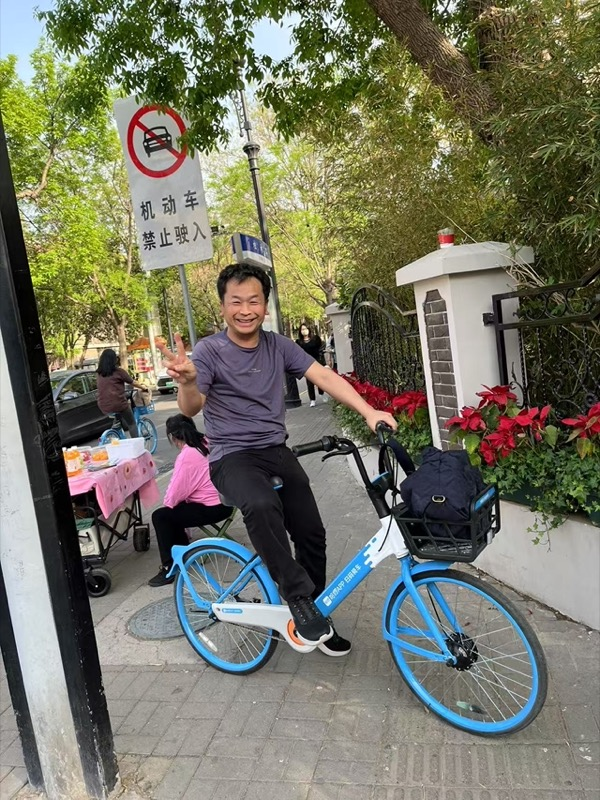 
*[ALIpayでレンタル自転車に乗ってみた]*

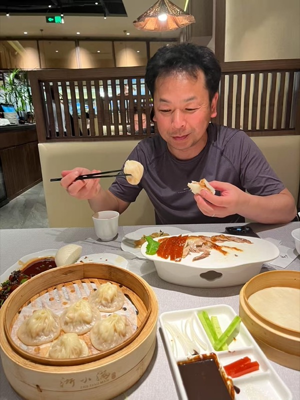 
*[ショッピングセンターのレストランは、うまい！]*

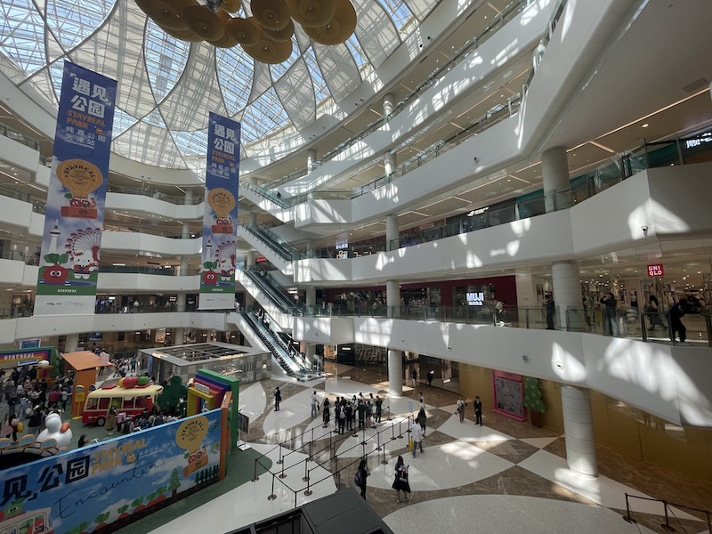 
*[ショッピングセンターは、どこも日本よりも凝った作りでおしゃれ]*

平日にもかかわらず、買い物意欲は相当高く感じられた。モールでの食事は、ほとんど日本と同じ価格である。平日の夕方5時半から、庶民がこぞって夕食を食べ始めている。まったく特別感はない。

天津だけでも東京並の経済規模と思われる。このような都市が、中国国内にいくつもいくつもある。

ここ天津は、ほんの20〜30年前には、高層ビルやショッピングモールなどは一つもなかった。何も無かったからこそ、ゼロベースで社会主義体制で街づくりを行えた。

人口10億のパワーは凄まじい。中国だけが世界のモノづくりのノウハウと設備とサプライチェーンを押さえている。内需と友好国との貿易を拡大する、だけと考えて当然にも感じられた。

走っている車のブランドは本当に多様である。トヨタやホンダも走ってはいるが数は少ない。

 
*[ショッピングセンターは本当におしゃれで人が多い]*

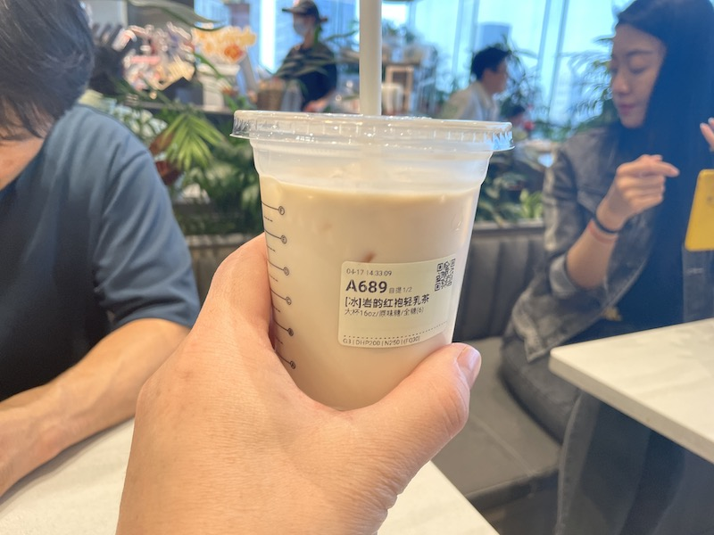 
*[コーヒーチェーン店も多い]*

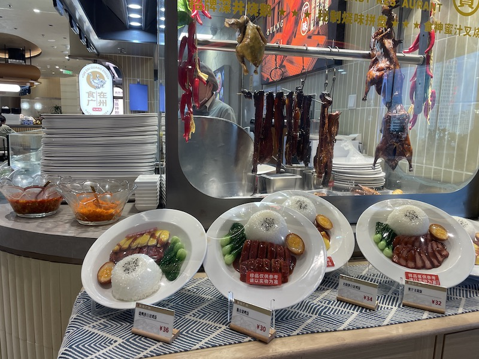 
*[ローカル料理もおいしそう]*

 
*[曲線を多様した複雑な造形の建物が多い]*

 
*[言っては失礼でも無知なんだけど、中国のイメージではないよね]*

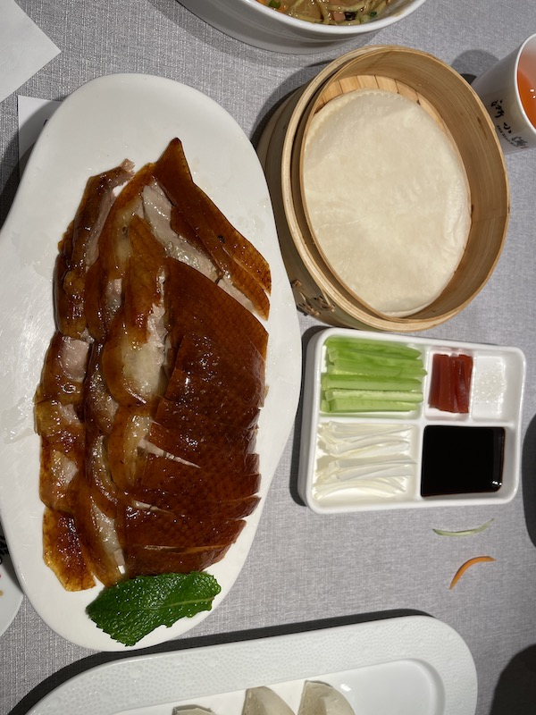 
*[せっかくなので北京ダックも食べてみた]*

しかし、どのメーカーもシェアは10%未満であろう。ガソリン車は本当に少ない。街中しか見ていないが、唯一発見したガソリンスタンドはクローズであった。

自動車は擦り合わせ技術で、かつメンテナンスがあるから、新規参入は困難と言われていたように記憶しているが、そんなことは、全く関係無さそうである。また中国の一般人はブランドや歴史も関係無いと考えている。

EVが優遇され、価格も安いなら、特に若い人はなんの抵抗も無いのではとのこと。ただし、どのメーカーのEVも例外なくかっこいいデザインである。また古くてボロボロという車もほとんど走っていない。

日本の自動車や家電製品のメーカーは、技術力やブランド力を過信しすぎたのかもしれない。

国際情勢によるが、中国も強気の姿勢を崩すことはないであろう。また、アメリカの政策で経済の縮小することを看過するはずもない。

アメリカが、中国に対する関税政策を貫くなら、アメリカは高いものを買うしかなくなる。しかしアメリカ国内には、既に生産体制は無いに等しい。

巡り巡って日本に、スギヤスにチャンスあり、となるのかもしれない。

天津から上海の空港に返ってきて、タクシーでホテルに向かう道、なぜか途中の暗い通りで降ろされてしまった。
とぼとぼ歩いていたら、遠くにみえる店の灯り。

身振り手振りて、困りはてていることを伝えたら、
自分のスマホで調べてくれて「あっちに行けばあなたたのホテルはあると思うよ」と。

お礼に、お店で売っていたバドワイザーを購入。
ホテルに着いてから一人、一期一会に感謝した。

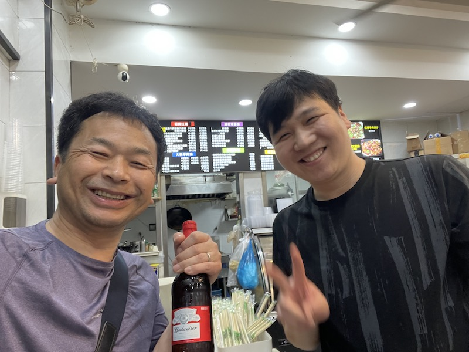 
*[夜中にタクシーのおじさんに変な所で降ろされて途方にくれていたら、このお兄さんが助けてくれた]*

 
*[お礼にバドワイザーを購入]*

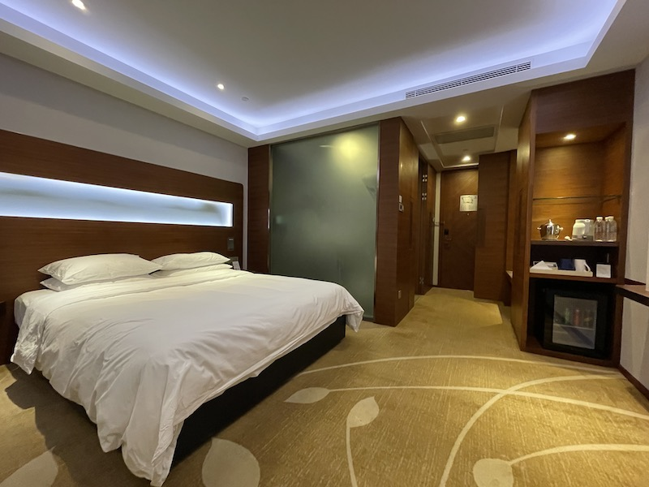 
*[ホテルの部屋で一人、ご苦労さん会　中国のホテルはどこも豪華(Nobotel)]*

### 奥村視点（Day3：展示会最終日）

山崎が天津へ向かった一方、奥村はelectronica China 最終日（3日目）の視察を単独で続けた。

> 「本日最終日。残された時間でモータ制御デバイスを探した結果、電動車用途で使えるコントローラを持っている企業2社、（Artery Technology と　Cmsemicon)と連絡先を交換出来ました。私の拙い英語力でどこまで伝わったかは分かりませんが、・何万〜何千という大ロットではなく少数で買えるのか？（買えるという回答だった）・同様のものを扱っていて既に日本に上陸しているメーカーはないのか？というポイントで帰国後もリサーチを続けます。」（奥村）

半導体ゾーンの層の厚さについても、次のように記録している。

> 「今日は半導体ゾーンを回ってみて全く聞いたことが無い半導体部品メーカーが無数にあることに驚きました。モータドライブ用のFETだけ見ても中国ローカルメーカーが30社はあります。中国をはじめ東南アジアに乱立する新興EVメーカーは大手のものを使わずに、こういうところから部品を調達して安く仕上げているのかもしれません。」（奥村）

英語だけを頼りに単独視察したことについて、率直な所感も残されている。

> 「海外展示会を自分の英語力だけを頼りに視察する初めての経験をさせていただきました。あらためて伝えたいことが伝えられない悔しさを味わうことが出来ました。継続的に英語を学ぶことと合わせて、コミュニケーション能力の向上に努めます。今日、詳しい説明をして下さった方に記念に写真を一緒に撮ろうと持ちかけるも、2回断られて少し傷ついた奥村より報告は以上です。」（奥村）

これに対する前川TLへの返信では、会場構成についての観察も共有されている。

> 「出展者は中国国内の新興メーカーがほとんどですが、一流の大手企業も出展しています。ホールによって従来からある一流企業の集まり　→　隣のホールに進むとそのモノマネをしている新興企業だらけ　と、お互いに集合して出展しているところが面白いところです。日本の企業もそれなりに多く、TDK、太陽誘電、ニチコン、ヒロセ電機、菊水電子工業、日清紡、オムロンというところです。出展の方向性は、より高電圧、大電流、小型化という流れです。EVや電車向けのようです」（奥村）

### 補足写真：天津の朝（Day3）

 
*早朝、ホテルの窓から見える天津の街並み*

 
*ホテル下の駐車場*

 
*マンション街の通り角*

 
*天津の通り、バスと自転車*

 
*街路樹の並ぶ通りに停まったSUV*

### 補足写真：天津大学（Day3）

 
*「天津大学創立130周年」の広場サイン*

 
*屋内の宅配ロッカー、キャンパス建物内*

 
*食堂で煎餅（ジェンビン）を焼くスタッフ*

 
*食堂のテーブル、ミルクティーと煎餅*

 
*食堂でコーヒーを前に対面に座る同行者*

 
*「北洋智麺」ロボット麺キオスク*

 
*フルーツカップのクローズアップ*

 
*古い煉瓦建築近くの駐車場*

 
*「北洋大學堂 1895」の記念アーチ*

 
*キャンパス広場のブロンズ胸像*

 
*キャンパスの池にいる黒鳥*

 
*「実事求是」の校訓プレート*

 
*湖畔の公園、霞んだ市街地スカイライン*

 
*搬入口・サービスエリア*

 
*大学の陸上競技場*

 
*キャンパス芝生のピンクの花木*

 
*キャンパス建物入口、天津大学の学部標識*

 
*「天津大学薬学院」看板前での記念撮影*

 
*「中村文彦」の表札が入る研究室ドア前*

 
*キャンパスオフィスでパソコンに向かう様子*

 
*ロビーの装飾、新年バナー*

 
*煉瓦造りキャンパス建物脇の路上駐車*

 
*中村先生の研究室にて、デスクで作業中*

 
*実験室、薬品保管庫の脇にて*

 
*化学実験室、フラスコの並ぶ棚の前*

 
*薬学院のメイン玄関サイン前*

 
*空の階段教室（講義室）*

 
*天津大学正門アーチの前で*

### 補足写真：天津大学 食堂（Day3）

 
*食堂トレイの俯瞰*

 
*食堂の店内、学生が食事中*

 
*セルフサービスの惣菜バー*

 
*「牛東家 大块牛肉飯」の売店*

 
*火鍋風の売店*

 
*ローストチキンのショーケース*

 
*蒸し料理の売店*

 
*大学食堂で食事するトレイ*

 
*食堂で煎餅とタピオカドリンクを手に*

### 補足写真：南開大学・天津市内（Day3）

 
*電動キックスケーターに2人乗り、街路*

 
*南開大学の正門アーチ*

 
*南開大学正門前での記念撮影*

 
*水の抜かれた運河、天津の工事現場*

 
*同運河、工事区間の広い眺め*

 
*天津軌道交通の路線図サイン*

 
*「天津大学薬学院」看板の下で*

 
*シェアサイクルに乗って時計塔広場前*

 
*「車両進入禁止」サインのある通り角にて*

 
*「天津市歴史風貌建築」のプレートがある門*

### 補足写真：天津自然博物館・文化施設（Day3）

 
*天津自然博物館前広場、曲面ガラスのファサード*

 
*博物館アトリウム、恐竜骨格・翼竜模型*

 
*剥製展示のサイのジオラマ*

 
*剥製展示のヌーの群れジオラマ*

 
*剥製展示のライオン、サバンナ背景*

 
*パンダのジオラマ展示の前で*

 
*館内の自販機・冷蔵ケース*

 
*制服姿の学生団体、博物館入口ガラス天井下*

 
*石とガラスのモダンな建物外観*

 
*湖に浮かぶ巨大なインフレータブルマスコット*

 
*ダイヤカット状のガラス建築前での記念撮影*

 
*日本食レプリカのショーケース*

 
*カフェのアイスコーヒー*

 
*モール通路、プラダ・グッチの店舗前*

 
*プラダ店舗のクローズアップ*

### 補足写真：EV・街並みウォッチング（Day3）

 
*街路、ターコイズ色のEVタクシーとテスラモデルY*

 
*欧州租界風の通り、レトロ衣装の歩行者*

 
*路上、トランクを開けたSUVと日産キャシュカイ*

 
*賑わう通り、シェアサイクルとメルセデスコンバーチブル*

 
*天津の交差点、曲面ガラスの近代建築*

 
*シェアサイクルで教会風の赤い尖塔建築へ*

 
*天津川沿いのスカイライン、歴史的な時計塔*

 
*通りの角、大連銀行の看板とシェアサイクル*

 
*夕暮れの逆光の中を走る自転車の一行*

 
*シェアサイクルアプリの決済明細（5.5元）*

### 補足写真：天津の夕食・帰路（Day3）

 
*麺・くらげ料理にタレをかける*

 
*蒸し饅頭と豚バラの角煮*

 
*北京ダック料理と手に持った春餅*

 
*せいろに入った小籠包*

 
*空いた皿と会計伝票*

 
*レストランで小籠包と焼き物を食べる*

 
*高級中華料理店でお茶を掲げる*

 
*カラオケバーのカウンターにて*

 
*モール内レストランの入口に立つ様子*

 
*地下鉄の券売機と路線図*

 
*薄暗い通路内のローソン*

 
*空港の出発案内板*

 
*空港のタクシー・バス・地下鉄案内サイン*

 
*空港保安検査エリア*

### 技術的考察

- **「天津だけで東京並みの経済規模」という所感は、中国国内に同規模の都市が多数存在することを踏まえると、物流・自動車整備・建設機械（リフト等）の需要規模が、単純な人口比以上に大きいことを示唆する。**

 
*[天津の街並み、、、東京クラス]*

- **天津大学の事例は、中国が優秀な人材への投資（低コストかつ高品質な学生生活環境）を惜しまない一方で、新卒就職市場には供給過多のミスマッチも存在することを示している。** 人材獲得・技術提携の観点からは、優秀な若手中国人エンジニアとの連携（共同研究、技術交流等）の余地が大きいことを意味する。

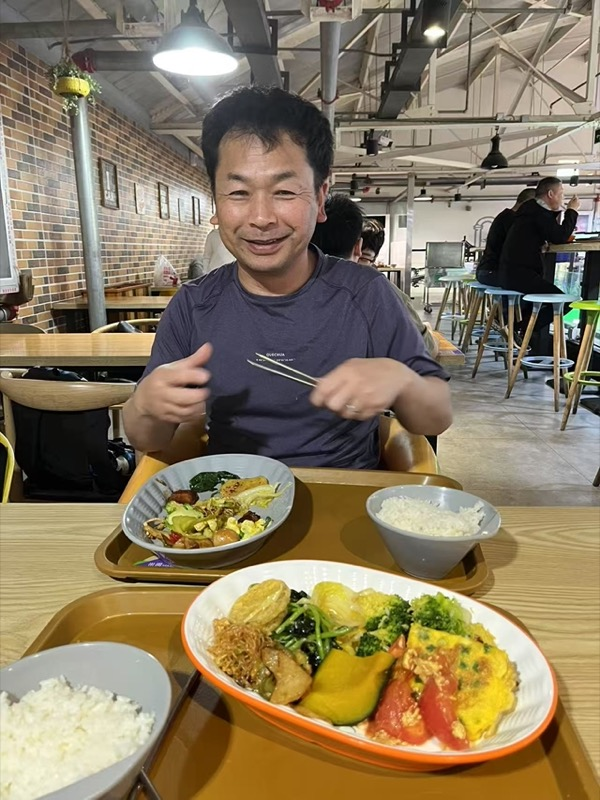 
*[どれもうまくて安い。学書もまた未来ある学生への投資の一貫]*

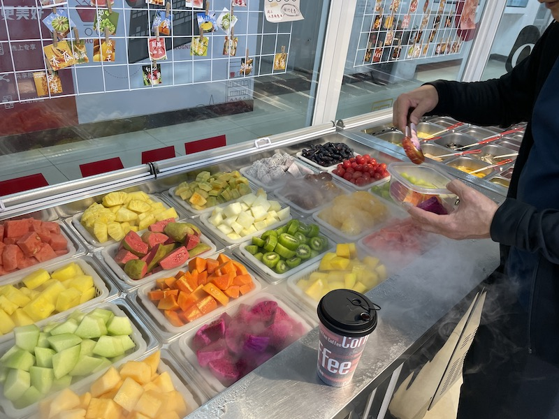 
*あちこちで売ってるフルーツの量り売り、、、信じられないと思うけど、ウマい*

- **EV普及の実態（ブランド忠誠度の低さ、デザイン重視、価格優位、ガソリン車・古い車の少なさ）は、自動車整備・周辺機器市場が、構造変化（バッテリー搭載位置、車体下部のセンサー・配線レイアウトの変化等）への対応を前提に再構築されつつあることを示している。**
- **「自動車は擦り合わせ技術＋メンテナンスがあるため新規参入は困難」という従来の見方が、中国EV市場では当てはまらなかったという観察は、モジュール化・標準部品の組み合わせによる新規参入が、自動車以外の分野（AGV/AMR、搬送機器等）でも同様に進む可能性を示している。**

### 新商品開発への示唆

- **自動車整備リフト**：中国市場で急速に普及するEV（ブランド多様・デザイン重視・低価格）に対応するため、リフトアーム形状やセンサー干渉対策などEV対応仕様の標準化を検討する。中国市場そのものへの展開可能性も視野に入れる価値がある。
- **物流搬送機器・AGV/AMR**：天津クラスの都市が多数存在する中国国内市場の物流需要規模は、AGV/AMRや搬送機器の市場として大きな potential を持つ。また、自動車分野で見られた「擦り合わせ不要・モジュール組み合わせでの新規参入」という構造は、AGV/AMR分野でも標準化されたコンポーネントの組み合わせによる新規参入が進む可能性を示唆しており、当社の商品設計にも応用できる視点である。
- **IoT／AI活用**：ショッピングモールや交通インフラの「洗練」は、キャッシュレス決済・シェアサイクル・各種センサー等のIoT基盤の上に成立している。当社のIoT機器開発の参考として、現地のUI/UXやインフラ連携の事例を継続的にウォッチする価値がある。
- **AGV/AMR・駆動ユニット内製**：奥村が接点を持ったArtery Technology・Cmsemicon（電動車用途コントローラー）は、小ロット購入可否を確認済み。帰国後リサーチの継続先として具体的な調達候補になる。中国ローカルのモータドライブ用FETメーカーが30社規模で存在する点も、コントローラー内製時の部品調達先として参考になる。

---

## Day4：2025年4月18日（金） NIDECドライブ・テクノロジー訪問

上海の虹橋駅から高速鉄道で約30分の立地。

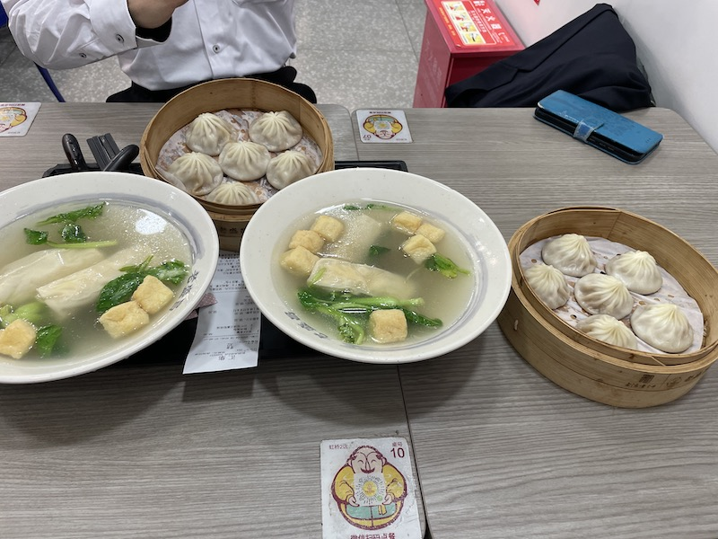 
*上海虹橋駅にてローカルの朝ごはんを*

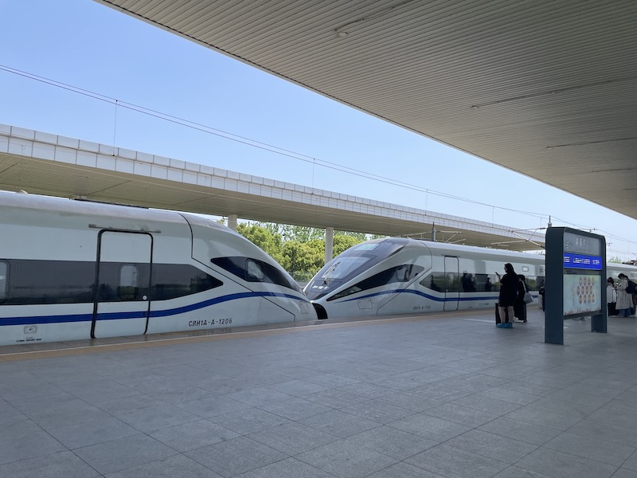 
*上海の高速鉄道*

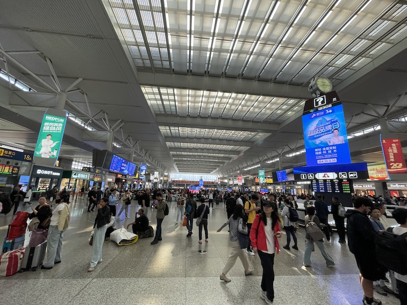 
*高速鉄道のホーム*

2002年頃から進出して、徐々に売上を伸ばし現在では100億円を上回っている。

総経理、副総経理、以下6名の日本人が対応をしてくれた。うち二人は、駐在できている間に、現地の女性と結婚してしまい、家まで購入してしまったとか。ほとんどが、60歳前後。最近の傾向として、若手が海外勤務を嫌がるとのこと。海外勤務しても、個人としてのデメリットばかりでメリットが無いとの内部事情も大きい、らしい。

 
*NIDECドライブ・テクノロジー訪問時、現地スタッフとともに*

遊星歯車の加工から組み付けまでの一貫生産工場を見学。様々なサイズで、量もバラバラで、けっこうな混流生産を行っている。

中国国内向けが半数（多くはロボット向け）とのことで短納期が求められることが多く、見込み生産で対応している。

 
*NIDEC社内のショールーム。「高精度減速机」コーナー*

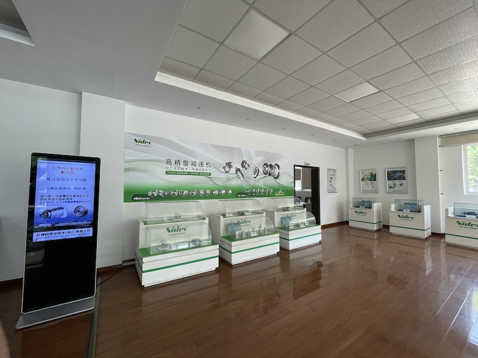 
*ショールームに並ぶ各種減速機の展示ケース*

 
*遊星歯車減速機（VR系列）・波動歯車減速機（WP系列）の製品ラインナップを示すパネル*

モーターは一部のみ内製しており、日本メーカーの高速シャッターに使われ、600個／月とのこと。見学した限り、大した装置は使用しておらず、我々でもできそうな印象は受ける。

キモは、誘導加熱による焼き嵌めや歯車の軸の圧入となる。これらには高い精度が求められるので、見た目ほど簡単ではないであろう。

数年前に、アメリカ向けの特需があり、尋ねるとAmazonに商社経由で収めたギヤードモータードライブホイールとのこと。どうやら、例の棚を運搬する自動搬送機は、Amazonが自ら開発して、ドライブホイールなどは部品として調達しているらしい。採用された理由は、ドライブホイールの停止精度であったとか。

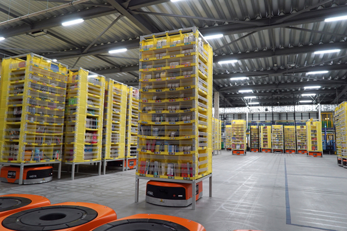 
*おそらくコレに、NIDECの高精度減速機が採用されている*

たまたま1月の展示会で、リーズナブルなドライブホイール・コントローラーセットを発見した。初回の打ち合わせ時に、上海出張が決まった直後であったこともあり、訪問を打診。そして本日の訪問が実現し、リアルに考えられるようになった。ヒトもコトもモノも、偶然の出会いが大切と、つくづく思う。

今回の出張を通じて、物流商品の課題である電動化のイメージを、リアルに持つことができるようになった。奥村くんの、静かなる闘志もわかった。

### 奥村視点（Day4：NIDECドライブテクノロジー工場訪問）

奥村も同行し、対応者・観察内容を日報に残している。対応者は山本総経理、宮脇部長、福埜CFO、中谷部長、堀部長の5名。

> 「帰国便の時間もあり、駆け足の訪問となってしまいましたが良い訪問となりました。人材育成や量産体制に対しての考え方など我が社にとっても参考になるお話が聞けました。昨日の展示会でも感じましたが中国では女性が男性と対等に活躍されています。日本人部長はサポート役で実務は中国人部長が行っているそうですが、購買や品質管理の部長は女性でした。」（奥村）

工場の量産基準・稼働体制について、具体的な数字を記録している。

> 「・月間500台を超えると量産と考え、材料を削り出しから鍛造に変えたり、全自動脱着もする　・それ以下では人が脱着している　・工場は24時間稼働。中国では男・女の区別をしない。人員では男女半々で女性も夜勤をするし管理職も多い　・当局からの環境規制が厳しくオイルミスとは日本の工場よりむしろ少なく労働環境も良い。　・減速機の工場だが一部モータの内製も行っていて小規模モータ生産の現場を見ることが出来た。」（奥村）

出張全体を振り返っての所感は次の通り。

> 「今回の出張で中国の勢いを肌で感じることが出来ました。営業の宮脇部長もおっしゃっていましたがトランプ関税でアメリカ輸出がダメになっても、内需が旺盛なのでやっていけると政府も踏んでいるようです。まだまだそこら中で建設工事をしていますし、自動車業界含めて日本は「追いつかれてしまう」ではなく既に「追い越されてしまった」印象を受けました。これから日本国内の展示会を見る目も変わります。」（奥村）

これに対し前川からのコメント。

> 「１週間お疲れ様でした。まずは無事に帰国して安心。中国への見方が全然変化して世界をリードしているということが日報から伝わってきました。良いところはマネをして一人一人の成長へつなげていきたいですね。」（前川）

### 補足写真：出発〜NIDEC訪問・帰国（Day4）

 
*ホテルのテレビ、CCTVニュース放送*

 
*ホテルロビーのラウンジ、早朝で無人*

 
*ホテルロビー受付とメザニン*

 
*ホテル前の黄色いタクシー、朝の出発*

 
*駅の手荷物サービスカウンター*

 
*駅構内のデジタル広告、Onvo EVの車両*

 
*NIDECショールームの壁面展示、減速機ラインナップ*

 
*昼食の弁当を俯瞰*

 
*抹茶ソフトクリームをすくう手元*

 
*車内でピースサインの記念撮影*

 
*街路、EVセダンが並ぶ通り*

 
*駅の改札でIDチェックを受ける様子*

 
*高速鉄道のホーム、停車中の列車*

 
*車窓からの農村風景、ビニールハウス*

 
*空港シャトルに乗る一行*

 
*ターミナル窓から見える東方航空機*

 
*機内食トレイ*

### 帰路（参考）

帰国時、空港で見かけた高所作業用シザーリフトと清掃ロボットを参考として記録した。

 
*空港施設内に並ぶシザーリフト（Genie製）*

 
*自動清掃ロボット（Karcher製）*

### 技術的考察

- **NIDECドライブ・テクノロジーは20年超かけて、遊星歯車減速機の加工〜組み付けの一貫生産体制を中国国内に構築し、100億円規模の事業に成長させている。** 見学した限りでは「大した装置は使用していない」という所感とは裏腹に、競争力の核心は**誘導加熱による焼き嵌めと歯車軸の圧入という「工程の精度管理ノウハウ」**にある。これは、設備投資の規模ではなく、工程ノウハウの蓄積こそが減速機事業の競争力の源泉であることを示す好例である。
- **Amazonのドライブホイールのケースは、AGV/AMR業界における「インテグレーターと部品メーカーの分業」モデルの典型例である。** Amazonは自動搬送機（棚運搬ロボット）を自社開発し、要素部品（ギヤードモーター＋ドライブホイール）のみを外部（NIDEC等）から調達している。
- **「ドライブホイールの停止精度」が採用理由だったという事実は、AGV/AMRの位置決め精度が、モーター単体の性能だけでなく、ギヤ・ベアリング・取付精度を含めたユニット全体の精度で決まることを示している。**
- **中国国内向け需要の半数がロボット向けであり、短納期・見込み生産で対応しているという点は、中国国内のロボット産業の需要量と納期要求の厳しさを物語っている。**

### 新商品開発への示唆

- **AGV/AMR**：NIDECのギヤードモータードライブホイール（Amazon採用実績あり）は、当社AGV/AMRの駆動ユニットとして直接の検討候補となる。1月の展示会で見つけた「リーズナブルなドライブホイール・コントローラーセット」の仕様確認・サンプル評価を次のアクションとする。停止精度を含むユニット単位での評価基準を整理する必要がある。
- **物流搬送機器**：遊星歯車減速機の混流生産体制（様々なサイズ・量に対応、短納期の見込み生産）は、当社の搬送機器（コンベア、リフト等）の減速機調達先として活用できる可能性がある。
- **自動車整備リフト・階段昇降機**：誘導加熱焼き嵌め・歯車軸圧入という高精度工程は、リフトの昇降機構や階段昇降機の駆動部の小型化・高精度化・静音化に応用できる可能性がある。また、空港で見かけたシザーリフト（Genie製）は、当社リフト製品との設計比較対象として参考になる。
- **IoT／AI活用**：モーター・ドライブユニットの内製を進める場合、各ユニットの稼働状態（温度・振動・停止精度等）をモニタリングするIoTセンサーをセットで設計することで、品質保証・保守性の面で差別化が図れる。空港で見かけた清掃ロボット（Karcher製）のような自律走行型サービス機器も、当社のAGV/AMR・福祉機器開発における周辺領域として参考になる。
- **量産化の目安**：奥村の観察による「月間500台超で量産体制（鍛造・全自動脱着）へ移行、それ未満は人手対応」という具体的な閾値は、山崎の「月100台以上」という所感と合わせて、モーター・減速機内製を検討する際の生産規模のベンチマークとして活用できる。

---

## 総括

4日間の出張を通じて、以下の点が明確になった。

1. **中国の電子部品サプライチェーンは、モーター・ドライブユニットそのものではなく、その一段下のコンポーネント（基板、半導体、抵抗、コンデンサ等）に強みを持ち、地球規模の集積地として機能している。** これにより、モーター・コントローラーの内製は「部品を組み合わせる」レベルでは現実的な選択肢になり得ることが、現場でのリアリティを持って確認できた。
2. **「月100台」という生産ロットの目安、「ドライブホイールの停止精度」という具体的な評価基準など、内製化・部品調達を検討する上での実務的な手がかりが複数得られた。**
3. **NIDECドライブ・テクノロジーの遊星歯車減速機事業は、設備の大小ではなく工程ノウハウ（焼き嵌め・圧入の精度管理）に競争力の源泉があることを示しており、Amazon向けドライブホイールの事例は、当社がAGV/AMRの駆動ユニット供給者・統合者のいずれの立場を取るにせよ、参考となるビジネスモデルである。**
4. **天津での市場観察からは、EVの急速な普及とブランド構造の変化、都市規模の物流需要のポテンシャルが確認でき、自動車整備リフト・物流搬送機器・AGV/AMRいずれの分野においても、中国市場の構造変化を前提とした商品設計・市場戦略の見直しが必要であることが示された。**

これらの知見は、`中期商品開発戦略_Draft.md` で示した「次世代AMR/AGV」「スマートリフト／フォークリフト」「画像認識AI基盤」の3本柱の検討において、特に駆動ユニット（モーター・減速機・コントローラー）の内製・調達戦略を具体化する上での重要な現場情報として活用したい。

---

## 写真について

- `Photos_Used/`：本報告書で使用した写真
- `Photos_Unused/`：今回使用しなかった写真（個人の記録・移動・食事等を含む）
- `2025EleCN-Images/`：元の写真データ（変更なし）
