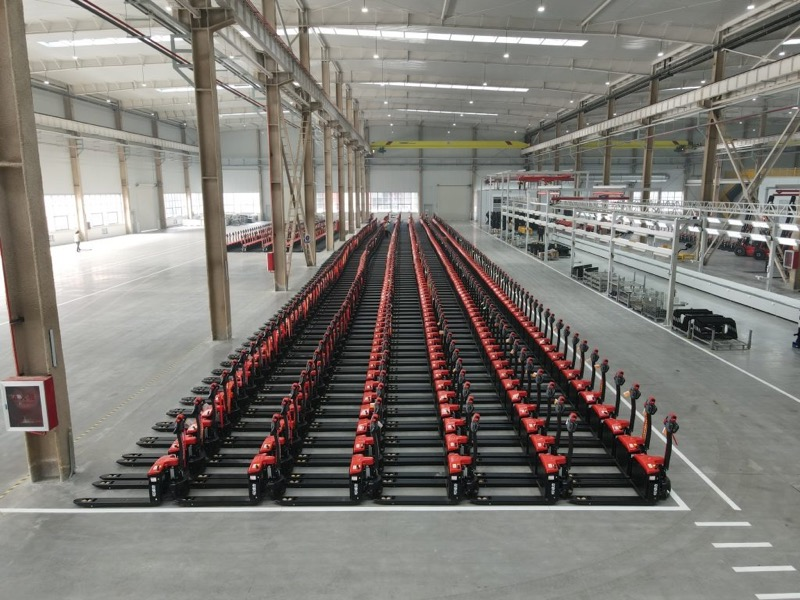

# EP Equipment Co., Ltd. 工場訪問レポート
## 浙江中力機械股份有限公司 訪問記録

---

## 1. サマリー

- EP社は2007年創業、7工場・4000名・年間30万台超を誇る世界的電動フォークリフトメーカーだ。2024年に上場（603194）を果たした
- 自社開発のAMR 150台が工場内で実際に自律稼働中。鉄製箱型パレットをフリーロケーションで段積みするシステムを、現場で初めて確認した
- 電動車2t・3t・5tに加え、両シリンダークリアビュースタッカー・簡易ティーチング式電動車など新製品が急増している
- 道祖土さん逝去後もALEXとの関係継続を確認。夕食を共にし、長期パートナーシップを再確立した
- 来年、ロボティクス専用開発センターが立ち上がる。開発者400名・うち半数がロボティクス担当という体制は、AMR・自動化分野での急成長を予感させる

---

## 2. 訪問概要・参加者

| 項目 | 内容 |
|---|---|
| 訪問先 | EP Equipment Co., Ltd.（浙江中力機械股份有限公司） |
| 所在地 | 浙江省工場（Zhejiang Province） |
| 訪問日 | 2025年11月26日（水） |
| 参加者（スギヤス） | 山崎部長、廣田、橋本 |
| 対応者（EP社） | ALEX（営業・入社15年・40歳）、Betty |
| 上場 | 2024年IPO、証券コード 603194 |
| 売上規模 | 約9億6600万ドル（2025年9月期） |
| ソース | EP Equipment公式サイト（ep-equipment.com）、PitchBook、2025年11月取得 |

 

EP社工場内に完成品を待つ電動パレットトラックが何百台も並ぶ。量産規模の大きさを示す一枚。（画像：EP Equipment公式サイト ep-equipment.com / 2025年11月取得）

EP社（浙江中力機械股份有限公司）は2007年創業の電動フォークリフト専業メーカーだ。杭州を本社に置き、7工場・4000名体制で年間30万台超を生産・販売する。電動フォークリフト分野で「NO.1」を掲げ、2024年のIPOを経てさらなる成長を加速させている。

 

EP社工場正門。「中力股份」「603194」の文字が大きく掲げられている。上場企業としての存在感がある。

---

## 3. 視察の目的

長年のパートナーである道祖土さんが逝去された。EP社との関係が途切れることへの懸念が生じていた。今回の最大の目的は、道祖土さん不在の後もALEXとの関係を継続・強化することだ。

加えて、展示会では何度も見てきたAMRの「本物の稼働現場」を確認すること。そしてEP社の最新製品ラインナップとスギヤスへの応用可能性を探ることも目的とした。

---

## 4. 背景（環境変化）

 

EP社ショールームの会社沿革パネル。「2009年に1工場から始まり、2024年IPO」まで、2.0電動化変革→3.0緑色化変革→4.0智能化変革という進化の軌跡が描かれている。

EP社は「電動化（2.0）→リチウム化（3.0）→智能化（4.0）」というフェーズで急成長してきた。現在は4.0、すなわちAMRと自律制御を全面に押し出すフェーズにある。

展示会のサンプルはさんざん見てきた。だが、現実には初めて見た。150台のAMRが実際に動いている工場を、この目で確認することになった。

量産規模・開発体制・資本力のすべてが、日本のサプライヤーとは桁違いの水準に達している。

---

## 5. 内容

### 5-0. 前夜（11月25日）・初回面談

訪問前夜、ALEXとBettyとの初回面談が行われた。工場内の応接室で、山崎部長・廣田さん・橋本が合流した。

 

（左）ALEX・Betty・山崎部長・廣田さんの集合写真。11月25日18:28（中国時間）。（右）会議室での山崎部長とBetty。資料を前にした初回面談の一場面。20:54（中国時間）。

道祖土さんの逝去を最初に切り出した。ALEXは動揺することなく、今後の関係継続の意志を明確に示した。Mr.フー（EP社創業者）の信頼が厚いALEXとの関係は、道祖土さんを介さなくても成立している。ただし道祖土さんの後継者が社内で不明瞭であり、その点は今後の懸念事項として残った。

 

面談後の夜。ALEXとの別れ際、EP社前にて。20:53（中国時間）。

### 5-1. 到着・ウェルカムプレゼンテーション

 

EP社会議室のウェルカムスライド。「株式会社スギヤス 山崎部長 廣田様 橋本様 ようこそ！」と日本語で表示されていた。Bettyが担当した。

工場に到着すると、会議室のスクリーンに「株式会社スギヤス ようこそ！」と日本語で書かれたスライドが映し出されていた。15年のベテランALEXと若手のBettyが出迎えた。

 

EP社エントランスに設置された巨大工場マップディスプレイ。ALEX（タン色ジャケット）・Betty（赤黒EP社ジャケット）・日本側3名が工場全体像を確認している。

エントランスには工場全体の空撮マップが大型ディスプレイで展示されていた。7工場の全体規模を、まずここで把握した。

### 5-2. 工場見学（製造ライン）

 

EP社製造棟の内部。奥行き数百メートル規模のフロアに組立ライン・赤い搬送車・作業者が並ぶ。製造棟の巨大さを示す。

工場のスケールに圧倒された。バッテリー・油圧シリンダーまで完全内製しており、一棟で数百メートル規模のフロアが複数棟ある。

 

（左）バッテリー生産ラインの品質管理モニター。EP中力の管理システムが各ステーションの状態をリアルタイム表示する。（右）同ラインの全体俯瞰。12ステーションの進捗管理ボードが見える。

バッテリーは完全内製だ。天井吊りの大型モニターに各ラインのリアルタイム状態が映し出されていた。工程名は英語管理（「OP100 Cover Installation」等）で、グローバル基準の品質管理体制が整っている。

 

（左）バッテリー部品の組立エリア。青いコンテナに部品が整列し、作業者が一つひとつ組み上げる。（右）油圧シリンダーの内製ライン。何十本もの黒いシリンダーが次工程を待って並んでいる。

 

EP社パーツ倉庫。オレンジ・ブルーの大型ラックに部品が整然と収納されている。パーツのOEM供給事業の規模がうかがえる。

 

EP社工場フロアに並ぶ紫色の「anton GD30」電動フォークリフト。EP社のOEM製造力を示す一枚。ブランドを変えた完成品が量産されている。

OEM製造も旺盛だ。「anton」ブランドのフォークリフトが完成品状態で工場に並んでいた。パーツOEMにとどまらず、フォークリフト丸ごとのOEM製造まで手がけている。「量は関係なく、世界中の販売パートナーを大切にする」という姿勢の表れだ。

### 5-3. AMR自動倉庫

 

EP社AMR倉庫の通路。左右に青い鉄製メッシュパレットが2段積みで並ぶ。中央の通路をAMRが自律走行する。黄色のラインがフリーロケーション区画を示す。

展示会で何度も見たAMRの実稼働現場を、初めて目にした。

 

EP社自社製AMRスタッカーが倉庫内を自律走行中。青い鉄製箱型パレットをフリーロケーションで段積みする。床面に赤いレーザーセンサーの走査光が見える。（EP社 浙江工場 AMR自動倉庫 / 2025年11月26日）

EP社のAMR 150台が、鉄製箱型パレットをフリーロケーションで段積みしている。固定棚もレールもない。AMRが自分で場所を判断して積み上げる。展示会とは全く異なるリアリティがそこにあった。

 

EP社AMRの制御ユニット。小型タッチパネルにUbuntuのデスクトップが起動している。ロボティクス開発標準としてLinuxが採用されている。

AMRの制御ユニットにはUbuntuが動いていた。ROS2との親和性から、世界のロボティクス開発はLinuxに収斂しつつある。開発者400名・うち200名がロボティクス担当という体制は、この方向性を裏付けている。

 

（左）工場見学中の山崎部長（左）と廣田さん（右）。EP社のハイビズベストを着用。奥にはEP社AMRが稼働中。（右）EP社工場棟の屋外。黄色いフォークリフトが複数稼働しており、スケールの大きさが伝わる。

### 5-4. ショールーム

 

EP社ショールーム全景。赤・黒の電動パレットトラック・スタッカーが整然と並ぶ。EP中力ブランドの製品ラインナップが一堂に会している。

ショールームには電動パレットトラック・スタッカー・リーチトラック等が多数展示されていた。電動車は2t・3t・5tのラインナップが揃い、改造対応も可能とのことだ。

 

（左）ショールームに並ぶ黒いスタッカー群。マスト・フォーク構造が際立つ3台。（右）ショールーム全体。右奥に「10 Ton Li-ion Forklifts」パネルが見える。高積載リチウムイオン車が新たなラインナップに加わっている。

両シリンダーのクリアビュータイプのスタッカーも存在していた。新商品が多数揃っており、スタッカー製品のバリエーション展開が急激に広がっている。

 

（左）黒いEP製電動パレットトラック前面。EP EQUIPMENTロゴが入った洗練されたデザイン。（右）EP赤色パレットトラックのドライブユニット接写。72V / ETBの仕様が確認できる。

 

EP社スタッカーのマスト・チェーン機構の接写。ラックアンドピニオン方式の昇降機構と黄色いセンサーユニットが確認できる。精密な内製部品技術がうかがえる。

特に印象的だったのは、簡易ティーチング式の電動車だ。相当に魅力的な仕上がりで、スギヤス製品との組み合わせや代替製品として検討に値する。

### 5-5. 食事（11月26日昼）

 

ALEXとの昼食。木製の牛に乗せた演出料理が運ばれるシーンで会話が弾んだ。（11月26日 11:05 中国時間）

ALEXと共にした食事の時間が、今回の訪問で最も手ごたえを感じた時間だった。ビジネスを超えた関係が構築できたと確信した。

パートナーシップは人と人の信頼でできている。

---

## 6. まとめ

### 視察全体を通じた気づき・所感

EP社の成長スピードは、「恐れ入った」の一言だ。

7工場・30万台・AMR150台・開発者200名。数字だけでなく、現場の空気がそれを証明している。来年にはロボティクス専用の開発センターが立ち上がる。開発者の平均年齢は30〜35歳。この組織はまだ成長の途中だ。

展示会のサンプルはさんざん見てきた。だが現実は別物だった。AMRが鉄製パレットを自律的に段積みするあの光景は、展示会の静的なデモとは全く異なるリアリティを持っていた。

中古フォークリフトのリビルト事業・パーツOEM・ブランドOEM製造まで、貪欲な商売を貫いている。量は関係なく世界中のパートナーを大切にする姿勢は強烈だ。

### 今後の展開・アクション

| アクション | 担当 | 期限 |
|---|---|---|
| 道祖土さんの社内後継者の確認 | 山崎 | 次回EP社コンタクト時 |
| 簡易ティーチング式電動車の詳細仕様・価格確認 | ［要確認：担当未定］ | ［要確認：時期未定］ |
| 両シリンダークリアビュースタッカーの見積もり取得 | ［要確認：担当未定］ | ［要確認：期限未定］ |
| AMR技術仕様の詳細確認（積載重量・段積み段数等） | ［要確認：担当未定］ | ［要確認：期限未定］ |
| ロボティクス開発センター開設後の再訪検討 | 山崎 | 2026年以降 |

### 不明・未確認事項

- ［要確認：道祖土さんの社内後継者が誰なのかが不明］
- ［要確認：簡易ティーチング式電動車の型番・価格帯が未確認］
- ［要確認：AMRの最大積載重量・段積み可能段数の仕様が不明］
- ［要確認：廣田さんの役職・フルネームが不明（ウェルカムスライドに「廣田様」とのみ記載）］

---

## その他の写真

本編の流れには収めなかった写真を収録する。

 

 

 

 

 

 

 

 

 

 

 

 

 

 

 

 

 

 

