# 第23回 国際オートアフターマーケットEXPO 2026 視察

> 作成日：2026-06-26　最終更新日：2026-06-26

---

## 出張概要

| 項目 | 内容 |
|---|---|
| 展示会名 | 第23回 国際オートアフターマーケットEXPO 2026（IAAE2026） |
| 会期 | 2026年2月12日（木）〜14日（土）10:00〜17:00（最終日16:00） |
| 会場 | 東京ビッグサイト 東展示棟7・8ホール |
| 主催 | 国際オートアフターマーケットEXPO実行委員会 |
| 出展規模 | 過去最大：378社（国内246社・海外132社） |
| 視察日 | 2026年2月13日（金） |
| 視察者 | 山崎 |
| 同時開催 | ロジスティクスソリューションフェア2026（西4ホール）、コインランドリー展、建材展示会 |

---

## 展示会概要

 
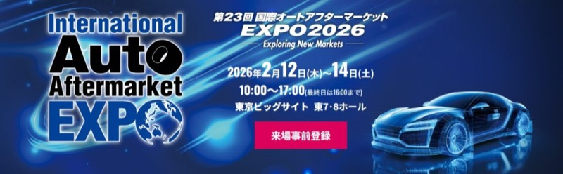

第23回 国際オートアフターマーケットEXPO 2026 公式バナー。（出典：ブレインテック株式会社 公式サイト、2026年1月）

 
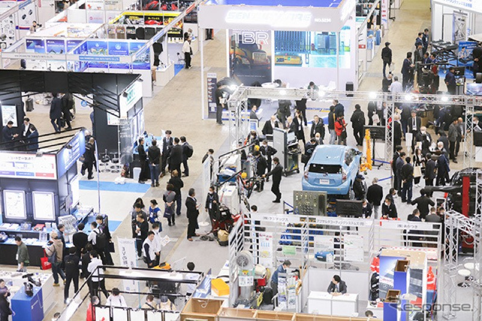

会場全景。東京ビッグサイト 東7・8ホール。（出典：Response.jp、2026年2月12日）

自動車の整備・メンテナンスを軸に、売買・環境・インフラまでをカバーする商談型見本市。
国内246社・海外132社、計378社が出展。過去最大規模だ。
中国メーカーの出展が増え、アフターマーケットの「中国化」が加速していることを肌で感じた。

---

# １．移動

 
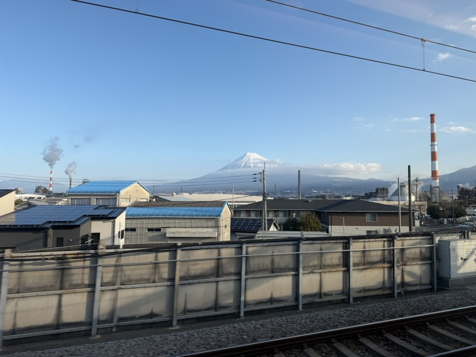

新幹線車内から望む富士山。東京への移動中。

---

# ２．中国アフターマーケット講演

 
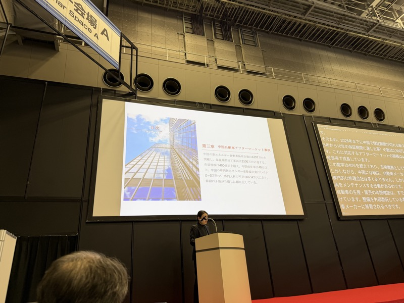

Seminar Space A。中国人講師による「中国市場における新エネルギー車のアフターマーケット」講演。

中国人による講演。テーマは中国市場における電気自動車・バッテリー車のアフターマーケット。
国家主導で整備学校を整備し、ベンツ・テスラ・トヨタまでカバーしているという事実は重い。
バッテリーの整備は無視できない。

 

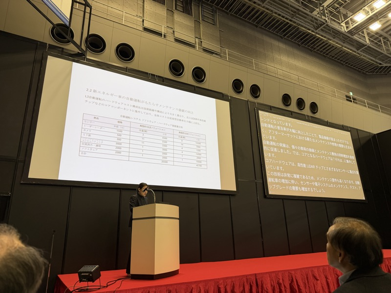
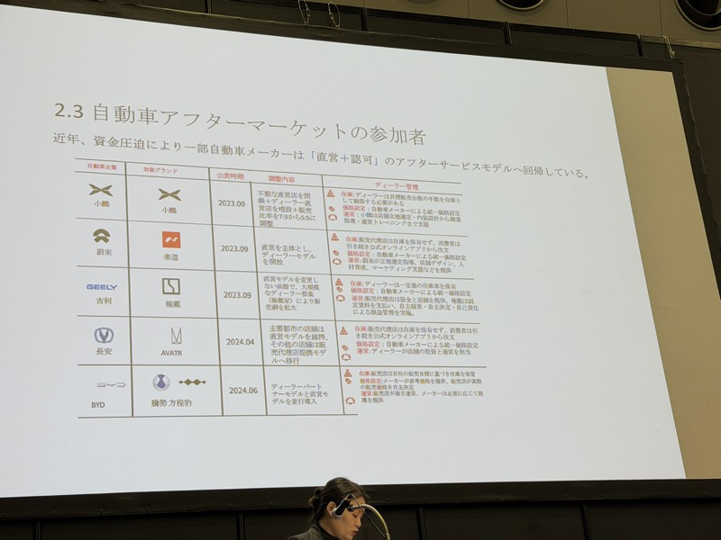

左：新エネルギー車がもたらすメンテナンス需要の拡大。右：中国メーカー（小鵬・蔚来・吉利・長安・BYD等）の直営・認可モデルへの回帰動向。

 

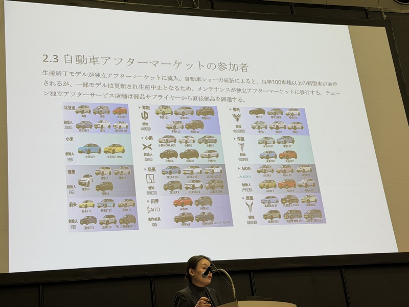
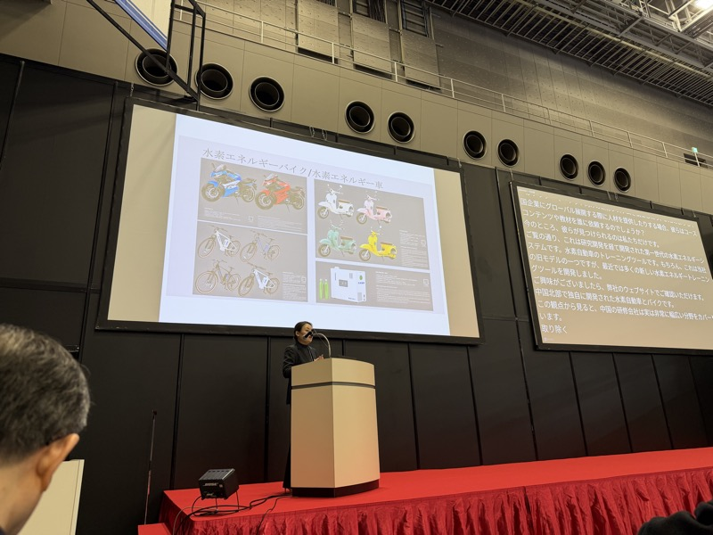

左：中国EV各社の車種ラインナップ一覧。生産終了モデルが独立アフターマーケットに流入する構造。右：水素エネルギーバイク・水素エネルギー車の整備需要。中国では水素分野の整備ツールも展開中。

 

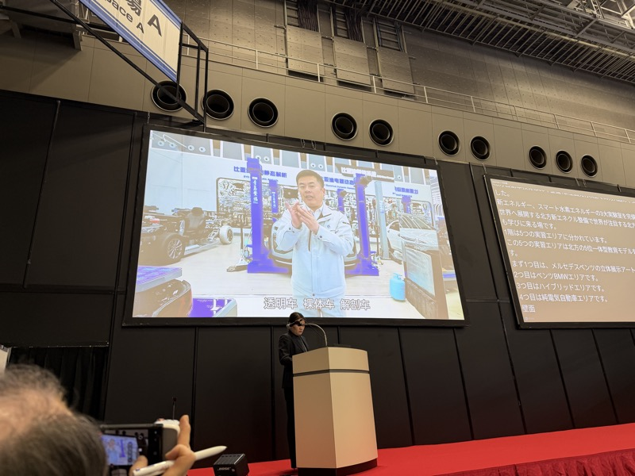
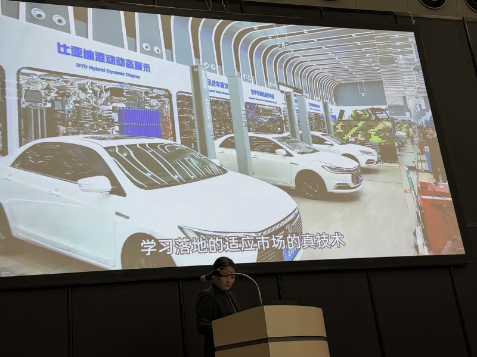

左：中国の整備学校における透明車・解体車・解剖車による実践教育。右：BYD Hybrid Dynamic Display。市場に適応した実技教育の充実ぶりが際立つ。

中国の整備市場は、国家が仕組みごと設計している。
個々の整備士の技量ではなく、システムで品質を担保する発想だ。
日本のアフターマーケットとは、根本的に異なるアプローチである。

---

# ３．コラムリフト視察（安全自動車ブース）

 

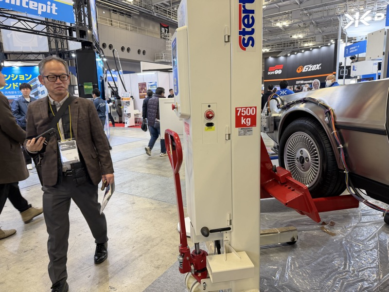
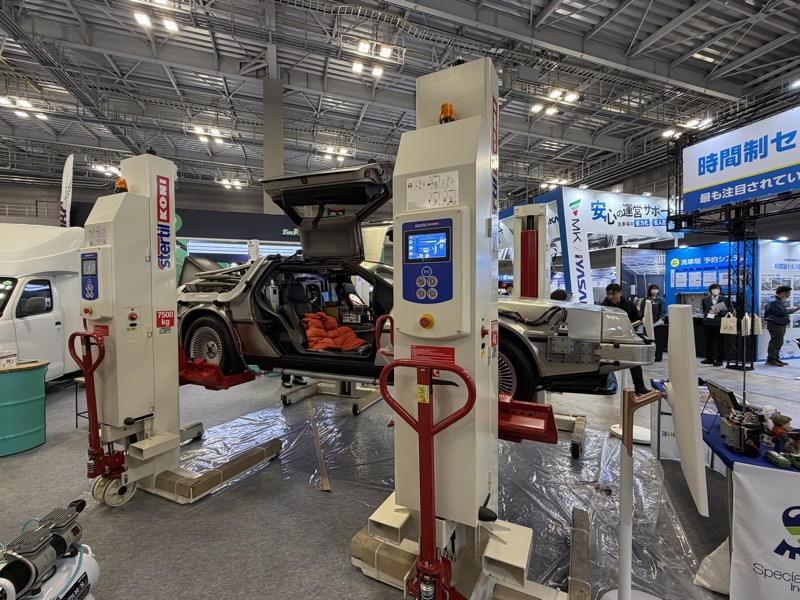

Stertil-Koni製 モバイルコラムリフト。7500kg能力。デモではデロリアンを持ち上げて展示。設置工事不要・無線同調が特徴。

 

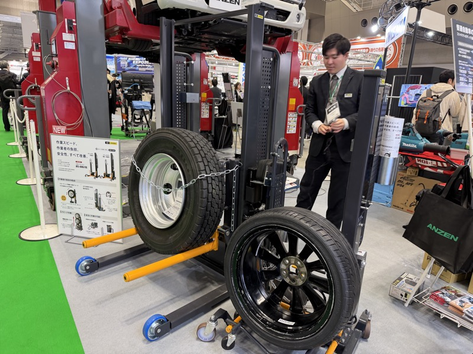
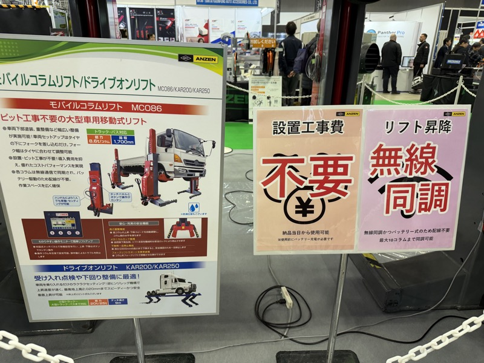

左：ANZENブース タイヤリフター（大型タイヤ交換用）。右：モバイルコラムリフト MCO86・ドライブオンリフト KAR200/KAR250 の説明パネル。「設置工事費不要」「リフト昇降無線同調」が最大の訴求点。

廣田GMはコラムリフトの開発を推している。
現場で聞いた数字：月6セット（4本/セット）が売れている。
仕入れ100万円/本、売り値は倍の200万円。
かなりのマージンだ。

イヤサカの今井社長からは、「コラムリフトの5トンタイプをぜひ」と具体的な要望を受けた。
廣田GMに開発妥当性の評価を指示した。

---

# ４．その他

 
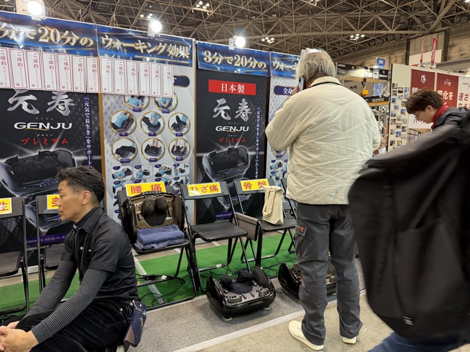

元寿（GENJU）プレミアム。「3分で20分のウォーキング効果」を謳う振動型マッサージ器。腰痛・ひざ痛・骨盤ケアを訴求。整備現場の腰痛対策ニーズと接点がある。

---

# ５．同時開催：ロジスティクスソリューションフェア2026

 
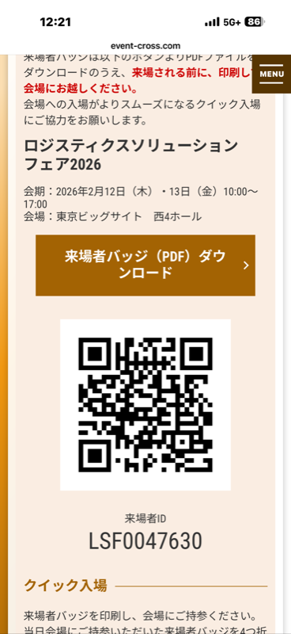

ロジスティクスソリューションフェア2026 入場バッジ。東京ビッグサイト 西4ホール、2026年2月12日〜13日開催。

IAAEと同日、同会場（西4ホール）で開催。物流DXに関するパネル展示が充実していた。
フィジカルインターネットの国家ロードマップが展示されており、立ち止まって全て撮影した。

## フィジカルインターネット

 
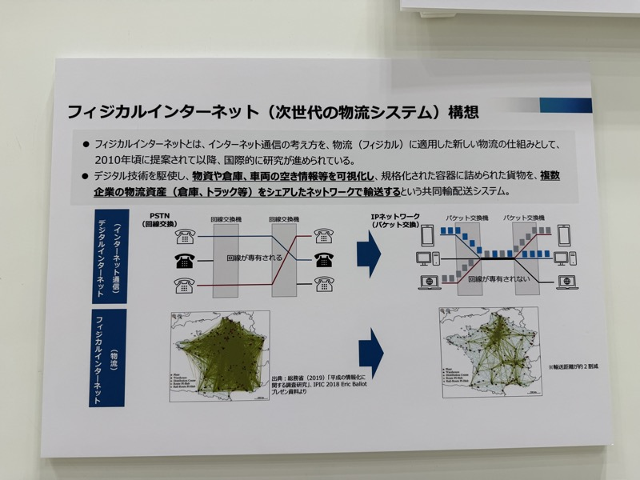

フィジカルインターネット（次世代の物流システム）構想。デジタル技術で物資・倉庫・車両の空き情報を可視化し、規格化された容器で複数企業の物流資産を共有するシステム。2010年頃から国際的に研究が進む。

 

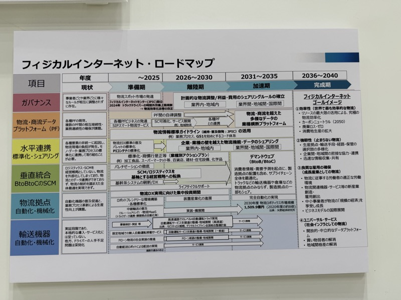
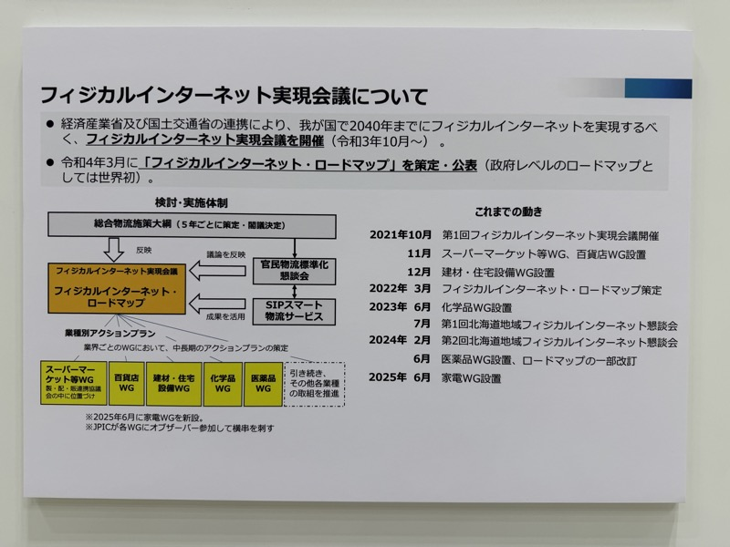

左：フィジカルインターネット・ロードマップ（〜2025準備期→2026〜2030隆盛期→2031〜2035加速期→2036〜2040完成期）。右：経産省・国交省連携のフィジカルインターネット実現会議（令和3年10月〜）。令和4年3月に世界初の政府ロードマップを策定・公表。

 

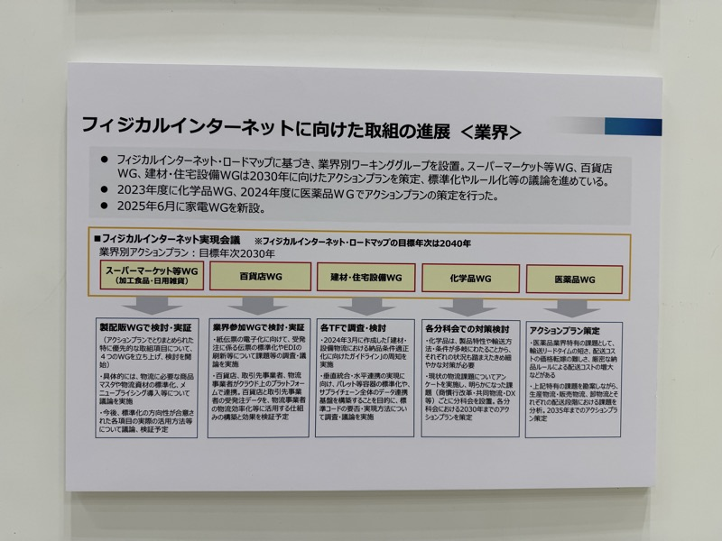
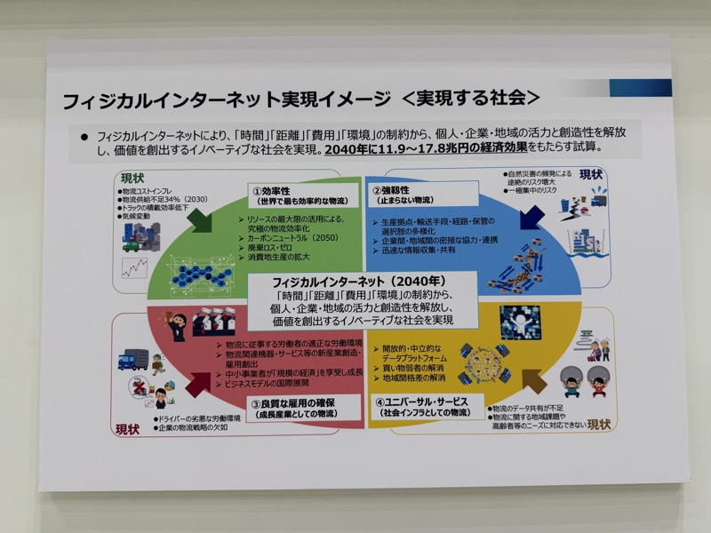

左：業界別WG（スーパーマーケット・百貨店・建材・化学品・医薬品・家電）の取組進展。右：フィジカルインターネット実現による社会イメージ。2040年に11.9〜17.8兆円の経済効果が試算されている。

 
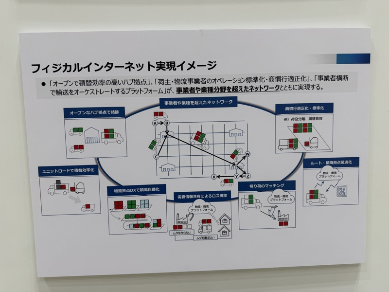

フィジカルインターネット実現イメージ。オープンなハブ拠点、積替効率化、帰り荷マッチング、物流拠点DXによる積載自動化が軸。事業者・業種を超えたネットワークで輸送をオーケストレートする。

物流の「インターネット化」だ。
回線交換からパケット交換への転換と同じ発想を、物流に適用する。
2040年に法整備まで含めた完成形を目指している。
政府が本気で動いている分野だ。

---

# ６．まとめ・所感

今回の最大の収穫はコラムリフト市場の実態把握だ。
月6セット・仕入れ100万円・売値200万円という数字は開発判断の根拠になる。
イヤサカから「5トンタイプを」という具体的な要望があった事実も重い。
廣田GMへの開発妥当性評価を指示した。結果を待つ。

中国のアフターマーケットは、もはや「整備」ではなく「産業」だ。
国家が設計し、学校を整備し、標準化する。
バッテリーをターゲットにした整備市場は、これからの10年で急拡大する。
日本のアフターマーケット業界は、この波に対して準備ができていない。

フィジカルインターネットは、物流の構造変革を国家として目指す動きだ。
2030年が隆盛期の入り口とされている。
弊社の商材がどこに位置づけられるかを、今から考える必要がある。

---

## その他の写真

本編の流れには収めなかった写真・動画サムネイルを収録する。

 

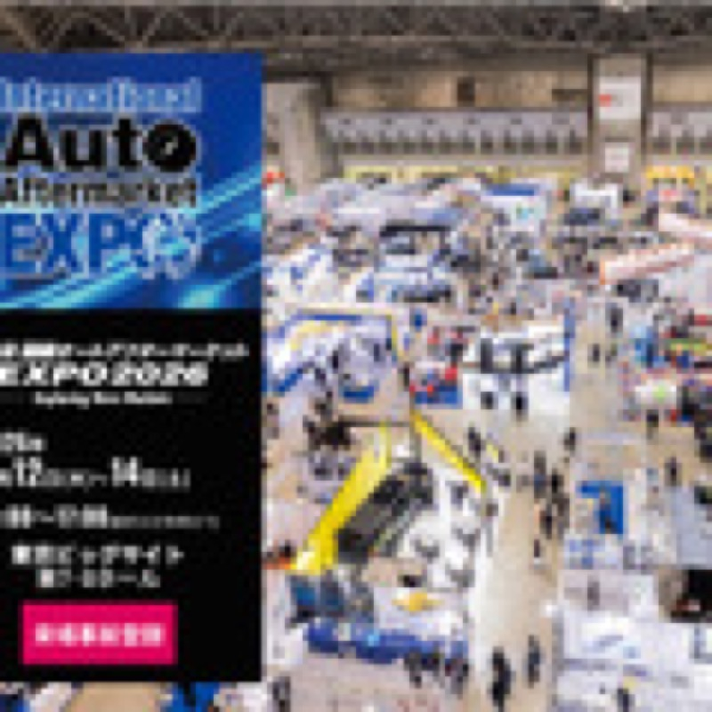
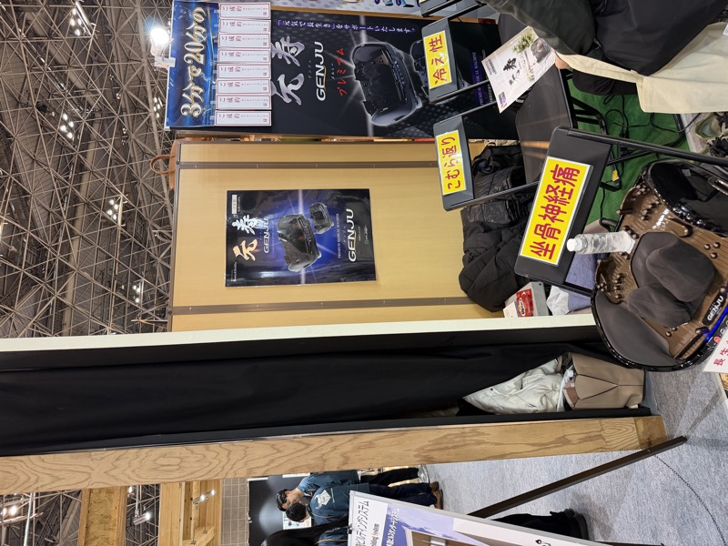

