# IMS Manutention 工場視察・商談レポート

---

## 会社概要・訪問概要

| 項目 | 内容 |
|---|---|
| 訪問先 | IMS Manutention |
| 業種 | 電動牽引トラクター・マテハン機器メーカー（フランス）|
| 設立 | 1973年 |
| 所在地 | Bonneval, Eure-et-Loir, France |
| 日時 | 2026年4月24〜25日 |
| 担当者 | ビンセント（Vincent）|
| 出張者 | 山崎・橋本GM |
| 目的 | 工場視察・製品デモ・商談（重量物牽引装置の販売代理検討）|
| 作成 | 山崎 |

情報ソース：[IMS Manutention 公式サイト](https://www.imsmanut.com/)（2026年7月）

---

## 訪問の目的

2025年3月の LogiMAT（シュトゥットガルト）で気になっていた **重量物牽引装置「DTR」シリーズ**のメーカー、IMS Manutention を訪問した。
1 トンから 10 トンまでの電動牽引トラクターを 2003 年から製造し続けているフランスの専業メーカーだ。

スギヤスの既存ラインナップに DTR を加えることで、重量物搬送領域での商品力を補強できるかどうかを見極める。

---

## 1. ランチミーティング（ボンヌヴァル）

 
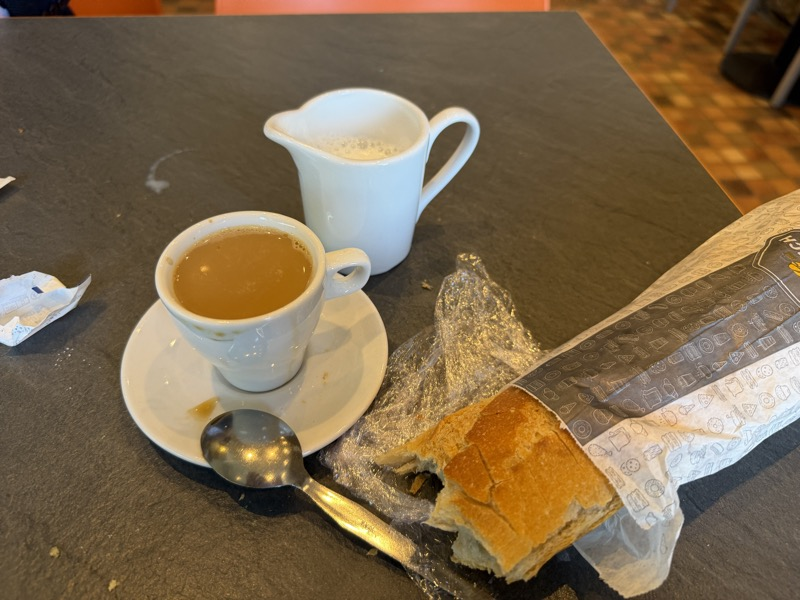

ビンセントと合流してカフェでのランチから始まった。バゲット＋コーヒー。典型的なフランスの昼だ。（2026年4月24日）

 

（左）ビンセントとランチ。バゲットを片手にサムアップ。（右）IMS Manutention のオフィスにて。山崎・橋本GM・ビンセントら4名での記念撮影。（2026年4月24日）

昼に到着し、ビンセントに出迎えてもらってランチミーティングから始まった。
工場のすぐ近くにある歴史的な村だ。美しい旧市街の街並みが広がり、観光地でもあるという。

ヨーロッパは、どこに行っても大体こんな感じで、だんだんと見慣れてきた。有り難みも薄れてくる。

フランス人は、目が合うとなんとなく会釈っぽい感じがある。馴染みやすさを感じる。

---

## 2. 製品「DTR」シリーズ

 
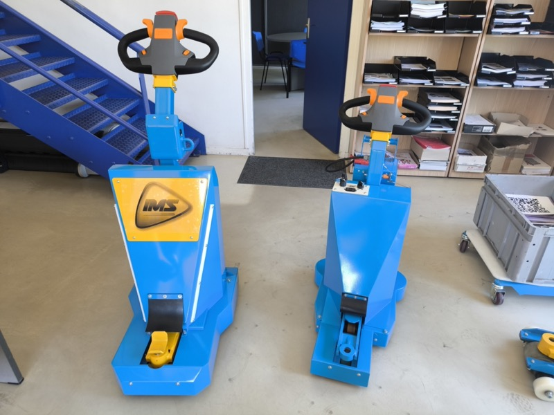

IMS Manutention の主力製品 DTR（Demi Tracteur Roulant）。青のボディに IMS ロゴ。2台並べて比較できる状態で展示してくれた。（2026年4月24日）

 

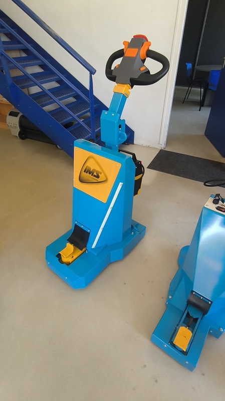
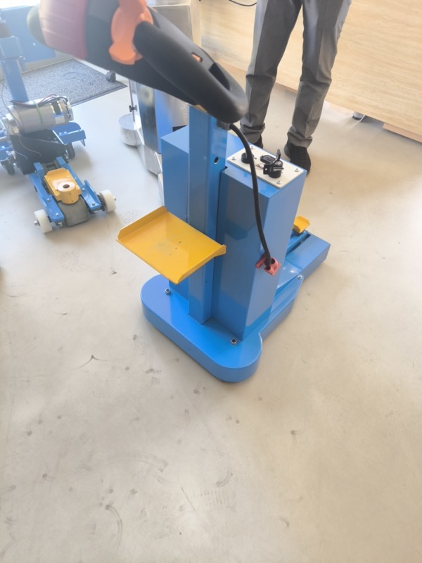

（左）DTR 正面。IMS ロゴと操作ハンドル。（右）DTR の実機デモ。担当者による実演で機動性を確認した。（2026年4月24日）

**DTR は昨年の LogiMAT から気になっていた商品だ。**
ラインナップは、1 トンから 10 トンまでの 4 種類。2003 年から作り続けている。
売れ筋は中間の **1.5 トンから 3 トン**くらいの牽引能力だという。

スギヤスの既存 DTR ラインナップ（「[要確認：DTR は既存で持っているか？]」）との重複確認が必要だが、商品力の補強になる。

### バッテリー

 
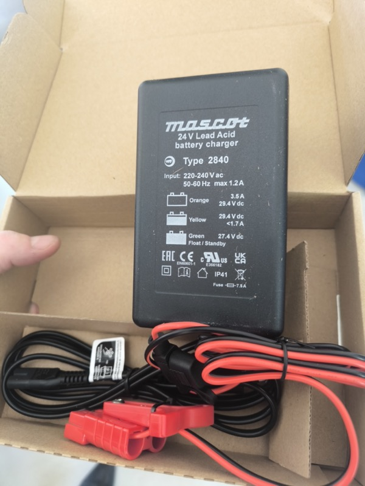

DTR に付属する Mascot 製 24V 鉛バッテリー充電器（Type 2840）。鉛対応品が標準同梱される。（2026年4月24日）

基本はリチウムイオン。ただし、**鉛蓄電池でも対応できる**という。
これはかなり柔軟だ。日本市場の一部ユーザーは依然として鉛を選ぶため、選択肢の広さはセールスポイントになる。

### コントローラー

 

DTR のコントロールパネル。IMS ロゴ・バッテリー残量計・速度ダイヤル・OFF/ON キースイッチ。シンプルで堅牢な設計だ。（2026年4月24日）

採用しているのは **PG ドライブ（PG Drive Technologies、UK本社）**。
カーチス（Curtis）よりも高性能であると判断して採用しているとのことだ。

---

## 3. 製品デモ

 

DTR の牽引連結部クローズアップ（動画より）。シルバーの牽引フック機構。各タイプで連結方式が共通化されている。（2026年4月24日）

 

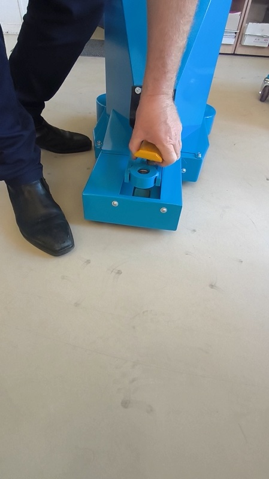

DTR の黄色い牽引フック（動画より）。ワンタッチで連結・解除できる。（2026年4月24日）

---

## 4. まとめ・所感

**LogiMAT で気になった理由が、現地でよく分かった。**

DTR シリーズはシンプルで堅牢だ。
2003 年から変えずに作り続けているという事実が、その信頼性を証明している。
鉛対応、PG ドライブ搭載、1〜10 トンの 4 タイプ展開――全部、顧客の要求に応えてきた結果だ。

IMS Manutention は規模は小さくても、**専業メーカーとしての軸がある**。
販売代理として取り組む価値は十分にある。

ただし課題はある。
**スギヤスの既存ラインナップとの重複整理**、**価格競争力**、そして**日本市場での安全規格対応（労安法・型式検定）**の確認が必要だ。

### アクション

| 担当 | 内容 |
|---|---|
| 橋本GM | IMS DTR シリーズとスギヤス既存品のラインナップ整理 |
| 橋本GM | 日本への輸入コスト・関税試算 |
| 技術部 | 日本市場の安全規格対応確認（労働安全衛生法・型式検定） |
| 山崎 | IMS との代理店契約条件の確認 |

---

## その他の写真

本編の流れには収めなかった写真・動画サムネイルを収録する。

 

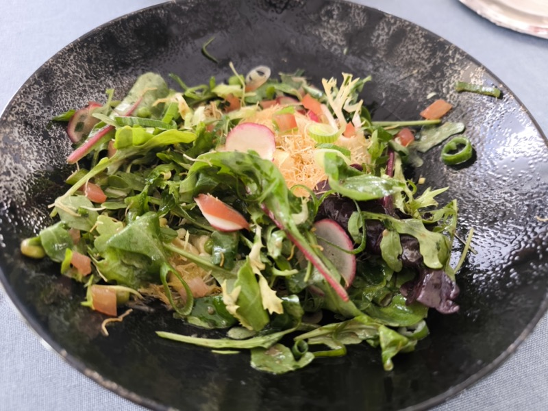

 

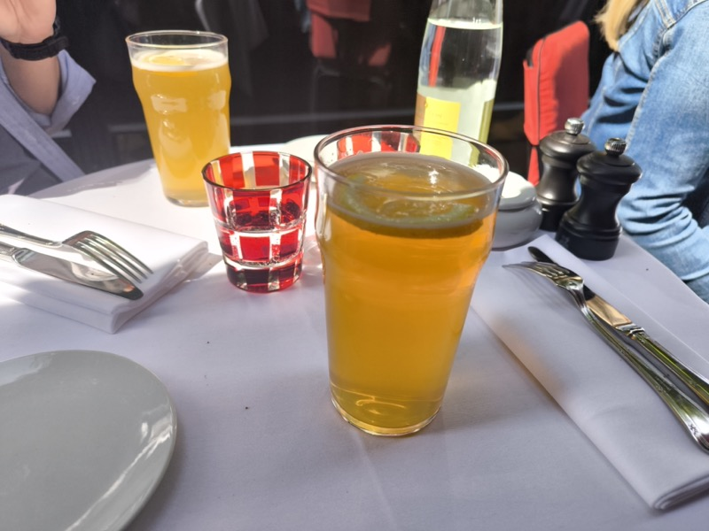

 

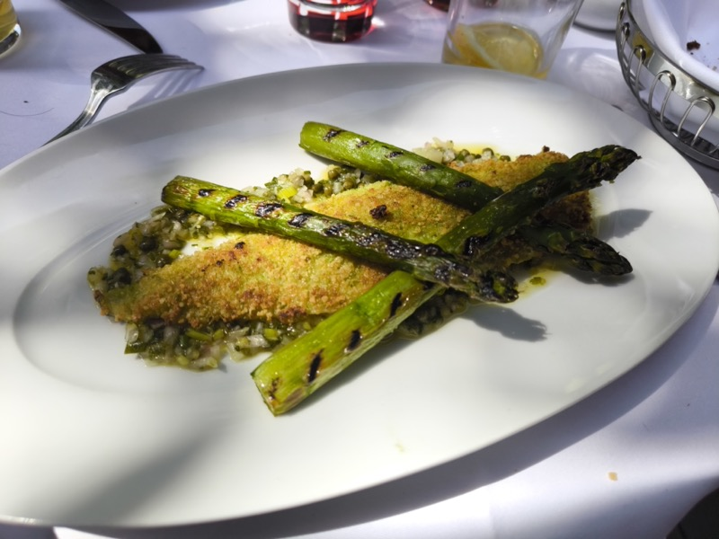

 

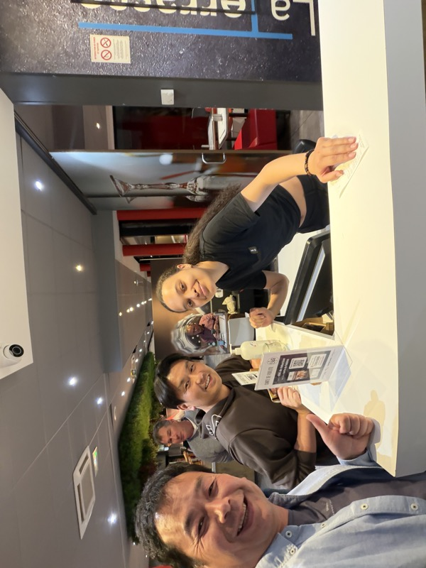

 

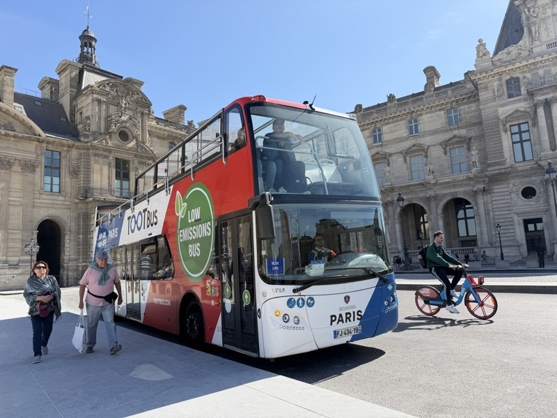
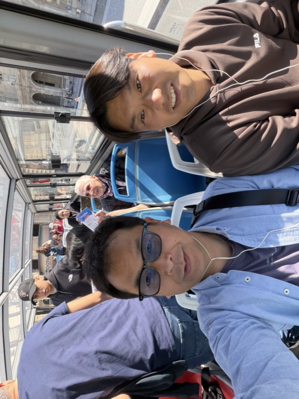

 

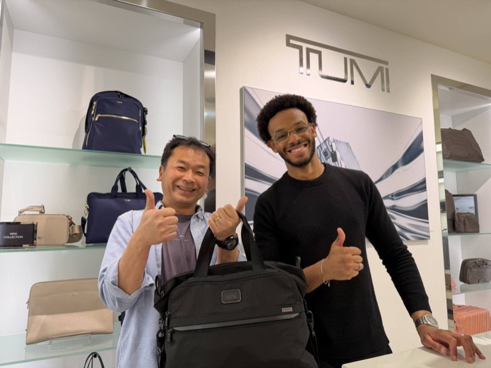

 

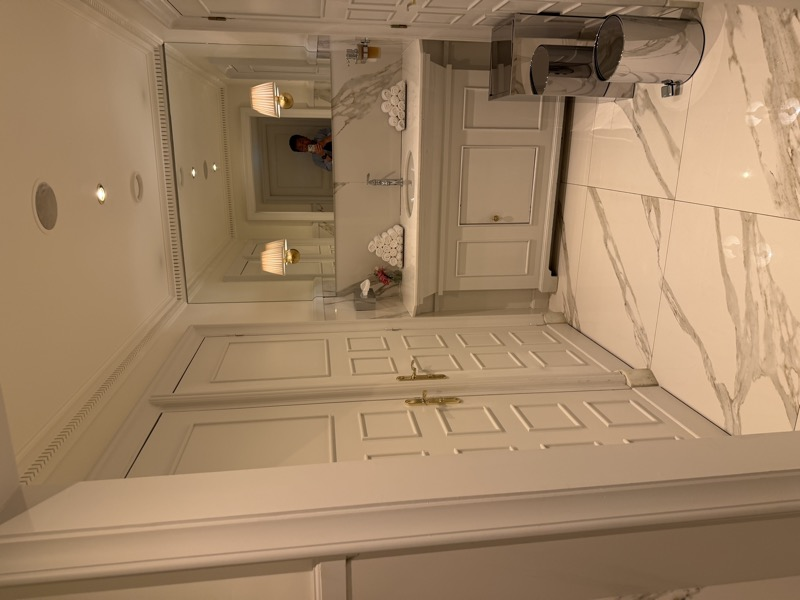

 

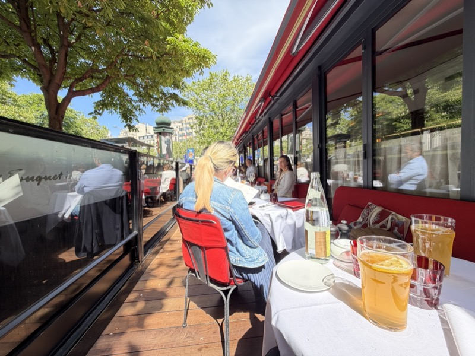

 

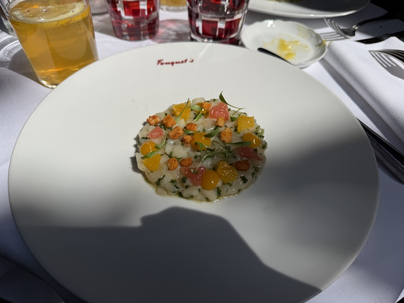

 

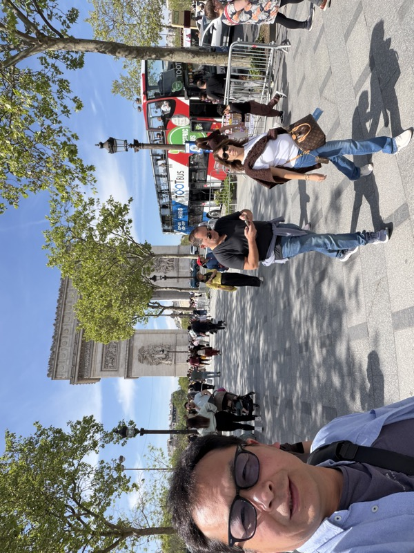

🟥🟥🟥🟥🟥🟥🟥🟥🟥🟥🟥🟥🟥🟥🟥🟥🟥🟥🟥🟥
<b>▼ 追記（AYamazaki 26/07/07）</b>

## 5. DTR実機納入・社内実機確認（2026年7月7日）

IMSから航空便で、DTRの実機が本日納入された。
社長、黒野部長、谷澤GM、新倉GM、廣田GM、前川TL、武村TL以下、技術部若手メンバーにて開梱と実機確認を行った。

 

開梱の様子。梱包は段重ねの木枠と段ボールを使ったもので、工夫をしながらのしっかりとしたスタイル。

 

開梱を終えたDTR本体。メンバー全員で細部を確認した。

### バッテリーの工夫

 

（左）バッテリーは別台車で運搬できる構造。（右）その台車ごと本体とドッキングする。随所に工夫が見られる。

### 駆動方式の確認

 

足回りの確認。荷重がかかっていないときはモーター駆動車輪を浮かせて軽く取り回せる。ビンセントが説明してくれていた大きな特徴である。

 

裏返して駆動方式を確認。

 

低床かつグリップをよくするための、チェーンを介した駆動方式。かなり考えられている。

### Bishamonトラックの牽引テスト

予め想定していた、Bishamonトラックの牽引を実施した。アタッチメントは即席で製作した。

 

BishamonトラックにDTRをセット。

 

即席製作のアタッチメントで前輪部に連結する。

 

牽引テストの動画より。目論見どおりに、牽引することが出来た。

### 追加のその他写真（2026年7月7日撮影分）

 

 

🟥🟥🟥🟥🟥🟥🟥🟥🟥🟥🟥🟥🟥🟥🟥🟥🟥🟥🟥🟥

## 評価後のまとめ　廣田追記 2026.7,13 関空へ向かう特急はるかより 

実車の確認を行ったところ、IMS牽引装置でデモトラを引くと、前後移動はできるが、旋回操作ができない 
トラックはハンドルを切らない限り、舵を切れない為 
IMS牽引装置は、DTRの上位（高能力）モデル 
となると、旋回操作感はデモとして重要な要素。また、デモトラではどこか自動車整備のアプリケーションに見えてしまう懸念もある 
よって、専用台車を牽引する方が見せ方として得策 
専用台車のサイズ感として、スギヤスでは馴染みがある、製造の4輪台車をイメージするので、製造よりもらってきた 
ところが、この専用台車は中間に二輪車輪があり、重量物を手で押せる事に特化している。 
これで見せてしまうと、意外と手で押せると誤解されてしまう  通常の４輪台車(前自在2輪、後固定2輪)で牽引する方が自然な提案 
もらった台車の車輪は耐荷重問題はあるが、まずは上記4輪にてトライを優先した方が良いかな　良い車輪があれば、ついでに変えてもよいけど 

ポイント（社長より） 
DTRで引ける重量では6tモデルのPRとして弱いので、2ｔ以上はの載せたい 
ただ、6ｔも持っていけない 
2ｔでも6ｔでも電動なので操作力は変わらない事が説明できれば2ｔレベルでいきたいな・・・と 

あとは、淵田が金曜日に社長よりレイアウト的な視点でアドバイスをもらってたかな？ 

橋本ＧＭがIMSより牽引事例の写真をもらって様な気もする

🟥🟥🟥🟥🟥🟥🟥🟥🟥🟥🟥🟥🟥🟥🟥🟥🟥🟥🟥🟥

🟦🟦🟦🟦🟦🟦🟦🟦🟦🟦🟦🟦🟦🟦🟦🟦🟦🟦🟦🟦
<b>▼ 追記（AYamazaki 26/07/13）</b>

## 6. 淵田くんとの打ち合わせ（2026年7月13日）

展示場ラボにて、淵田くんと打ち合わせを実施した。廣田GMが関空行きの電車内からGitHubに上げてくれた情報をもとに、話を進める。

多岐にわたる議論の末、最終的なアドバイスは一つに絞られた。とにかくスケッチを描くこと。CADではなく、イメージを共有することが先である。これをもとに、翌日は社長も交えて話をする段取りとした。

> 廣田GMがこうして、海外出張に行く移動中の電車からPUSHしてくれっていうのは、嬉しいねぇ！これが、目指しているスタイルだよ。（山崎部長）

🟦🟦🟦🟦🟦🟦🟦🟦🟦🟦🟦🟦🟦🟦🟦🟦🟦🟦🟦🟦

