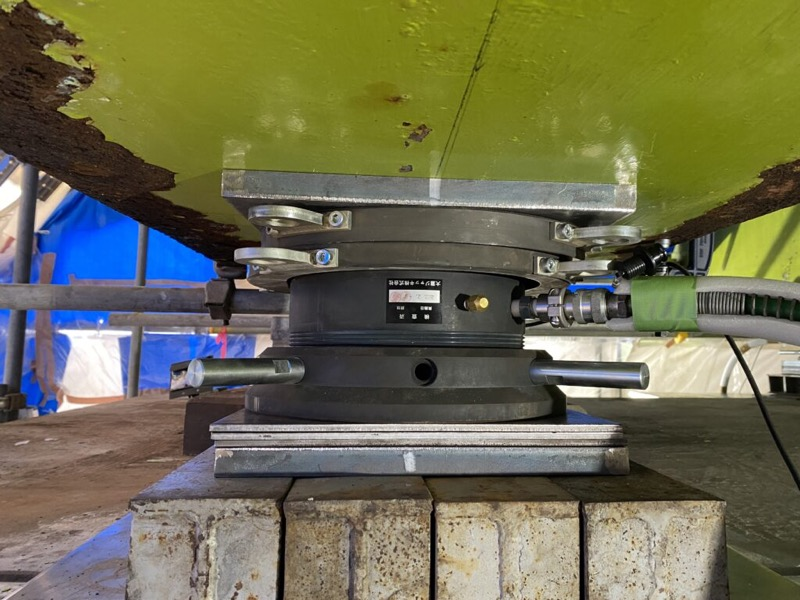
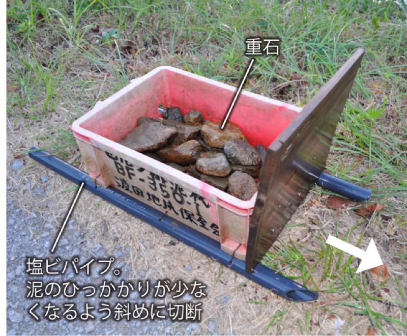
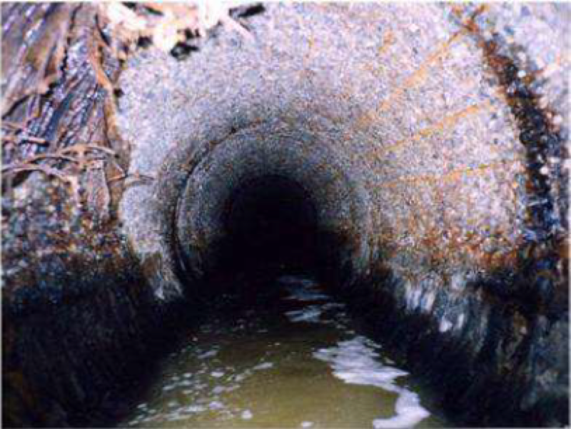

# 老朽化インフラ整備 新商品提案（IoT・AI・カメラなし）

> 作成：2026年7月1日　/infra-mente
> 出典：`Knowledge/NotebookLM.txt`（インフラメンテナンス包括的民間委託・製造業のサービス化に関するドメイン知識ベース）
> テーマ：IoT・AI・カメラを使わない、純粋な機械的解決策

---

## 基本方針

電子デバイスに頼らない機械的解決策は、導入ハードルが低く、現場が受け入れやすい。
予算規模も小さく、NETISの5項目（経済性・工程・品質・安全・環境）に対して即効性のある評価を示しやすい。
スギヤスが長年蓄積してきた昇降機構・油圧設計・搬送機構の知見だけで勝負できる領域だ。

---

## 新商品アイデア①：橋梁支承交換補助用 薄型油圧ジャッキセット

**該当項目**：戦略＝新技術導入による競争優位（NETIS）／自社の強み＝リフト油圧系統・ストローク制御・安全機構の設計知見

老朽化した橋梁の支承（橋桁を受ける緩衝材）の交換工事では、まず油圧ジャッキで橋桁を数ミリ持ち上げて仮受けする工程が必要となる。狭い桁下空間に収まる薄型・高耐荷重・セーフティナット付きの油圧ジャッキシステムを、自社のリフト油圧設計の延長で開発する。

整備用リフトで培った「持ち上げてから固定する」油圧＋機械ロック構造はそのまま転用できる。IoTもセンサーも一切不要な純粋な力学的製品であり、全国の橋梁補修工事（2030年までに建設後50年超の橋梁が約75%に達する見込み）という確実な需要がある。

 

橋梁の桁下に設置された補修用油圧ジャッキの施工例（出典：大瀧ジャッキ株式会社公式サイト）。薄型・コンパクトな設計で狭い桁下空間に収まる。

**リスクチェック**：既存の橋梁ジャッキメーカー（大瀧・大阪ジャッキ等）との正面競合になるため、「特殊仕様への対応力」でニッチを取ることが前提となる。知識ベースのGNT戦略（スーパーニッチでNo.1）に沿って、例えば「農道橋・用水路橋など中小河川向けの小型軽量仕様」に絞り込むことで差別化を図る。

---

## 新商品アイデア②：農業用水路・側溝向け 可搬式牽引型堆積物排出ユニット

**該当項目**：実行＝スモールスタート・高速PoC／自社の強み＝AGV走行機構・低速牽引制御・搬送系設計知見

農業用水路・道路側溝に堆積する土砂・泥は、年に1〜2回の清掃が必要だが、現状は農家や地域住民が腰を曲げてジョレン・スコップで手作業している。腰痛・熱中症・転落事故が絶えない重労働だ。

水路断面に合わせたスクレーパーブレードを備えた小型電動台車（電動モーター＋減速機のみ、センサーなし）を水路内に投入し、電動牽引で堆積土砂を一定方向へ押し出す可搬式清掃ユニットを開発する。AGV走行ユニットの駆動系をそのまま流用できる。

 

現状の農業水路清掃の実態（出典：月刊現代農業2019年7月号）。重石を積んだ箱を手で引く自作の排泥器が今も現役だ。機械化の余地が最も大きい領域の一つである。

**リスクチェック**：「補助金ありきで農家に配ろう」という発想になりやすいが、これは知識ベースの補助金依存の失敗パターンに直結する。補助金なしでも農家・土地改良区が「買う理由」になるROI（清掃コスト削減・労働安全改善）を先に数字で示す。地域の土地改良区との共同PoC（1水路・1シーズン試行）から始めるのが正しい順序だ。

---

## 新商品アイデア③：老朽管路更生工事用 マンホール設置型 資材挿入ガイド架台

**該当項目**：戦略＝メリハリのある資産管理（更生工法はコスト効率が高い既存インフラ保全手段）／自社の強み＝リフトの垂直ガイド機構・精密位置決め・架台設計知見

下水道管路の更生工事では、ガラス繊維や樹脂を含浸させた長尺のライニング材を、マンホール口から管路内へ引き込む工程がある。現状は作業員がマンホール縁にかがみながら資材を手で管口へ押し込む危険な重労働であり、位置がずれると管路に傷が入るリスクもある。

マンホール口径に合わせた折りたたみ式架台をセットし、電動昇降機構（リフト機構）で資材を管軸方向に正確に送り込むガイド架台を開発する。カメラもAIも不要で、シンプルな電動昇降のストローク制御だけで成立する。整備用リフトの「垂直精度を出しながら安全に下ろす」機構設計がそのまま活きる。

 

老朽化した下水道管路の内部（出典：千葉市公式サイト「管きょ更生工事の紹介」）。こうした管路への更生材挿入を安全・正確に行うための治具が、全国の更生工事現場で不足している。

**リスクチェック**：管路更生工事はNETIS登録済みの競合工法が多数存在するため、「更生材メーカーとの協業」で挿入補助治具の標準オプション化を狙うことで、独自開発した製品を市場に乗せやすくなる。要求水準書の整備に時間をかけ、発注側（自治体）との早期すり合わせが不可欠である。

---

## 3案の比較

| | ①橋梁ジャッキ | ②水路清掃ユニット | ③管路挿入架台 |
|---|---|---|---|
| 応用する自社技術 | リフト油圧・安全機構 | AGV走行駆動系 | リフト垂直ガイド精度 |
| 主な顧客 | 地方整備局・建設会社 | 土地改良区・農家 | 下水道工事会社・自治体 |
| 競合環境 | 中〜高（既存大手あり） | 低（機械化が遅れた領域） | 中（更生材メーカーとの共存可） |
| IoT・AI | 不要 | 不要 | 不要 |
| スモールスタート可否 | △（1件試行に時間） | ◎（1水路から即PoC可） | ○（1工事現場で試行可） |

---

## 黄金律との照合

知識ベースの黄金律：「新技術を『目的』ではなく『手段』として使いこなし、客観的データに基づいた『二段建てKPI』と『勇気ある撤退基準』を制度に組み込むことで、限られた資源を将来の再設計へと循環させる」

電子技術を使わない今回の3案は、この黄金律の本質に忠実だ。IoTやAIは「手段」であり「目的」ではない。機械的解決策でも、現場の「不」を確実に解消し、NETIS登録で公共調達の入り口に立てるならば、それで十分である。

着手の優先順位は②水路清掃ユニットが最も試行しやすく、撤退トリガーの設定も容易（例：1シーズンのPoC試行後に受注見込みゼロなら撤退）。①と③は1〜2年の先行投資を経て、公共調達実績を積むロードマップで進める。
