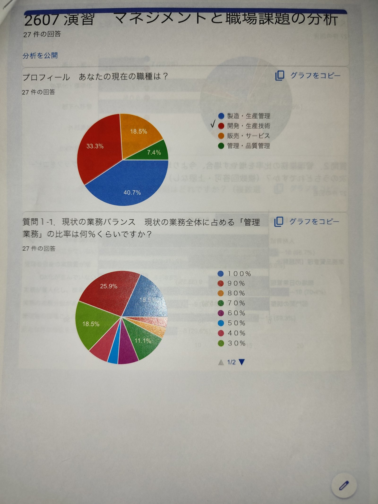
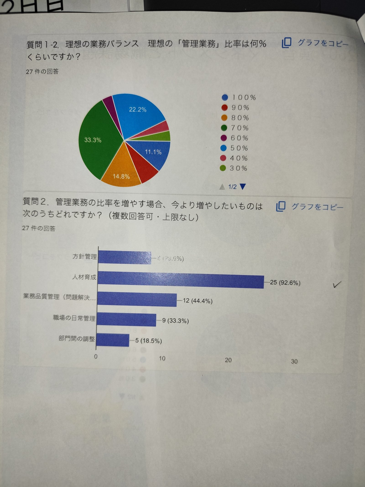
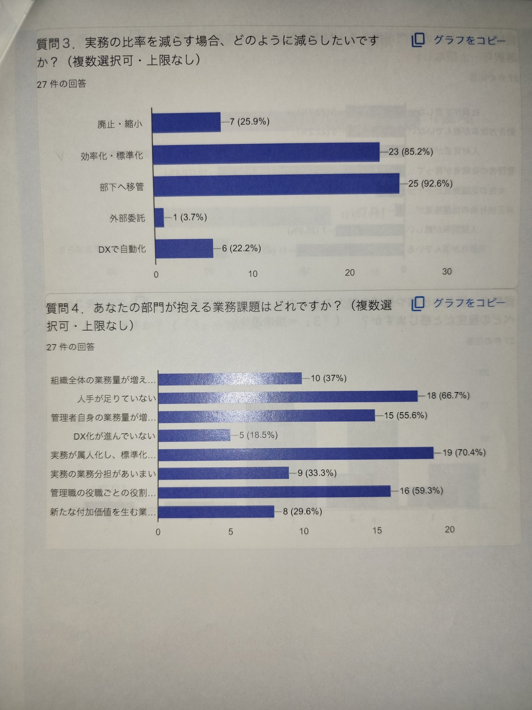
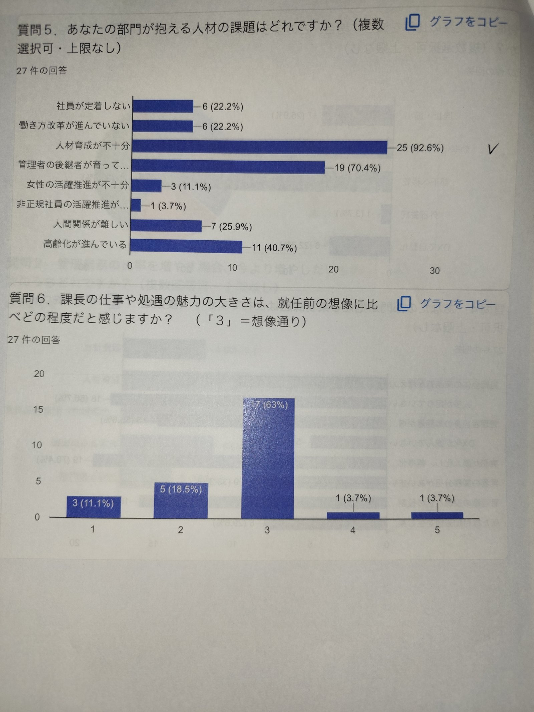
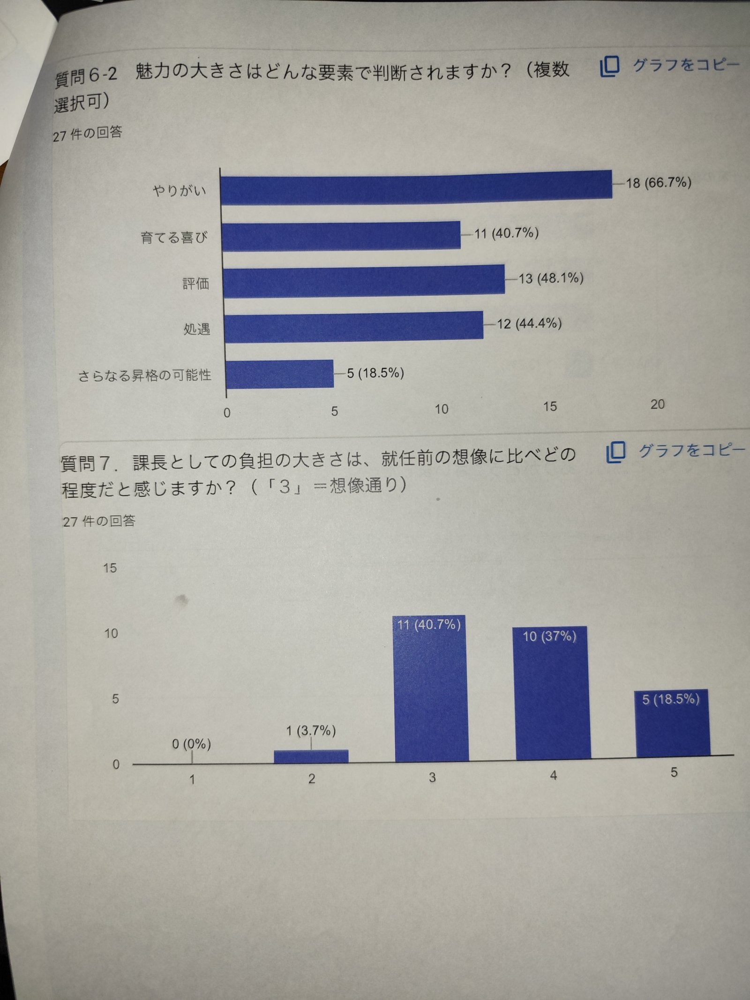
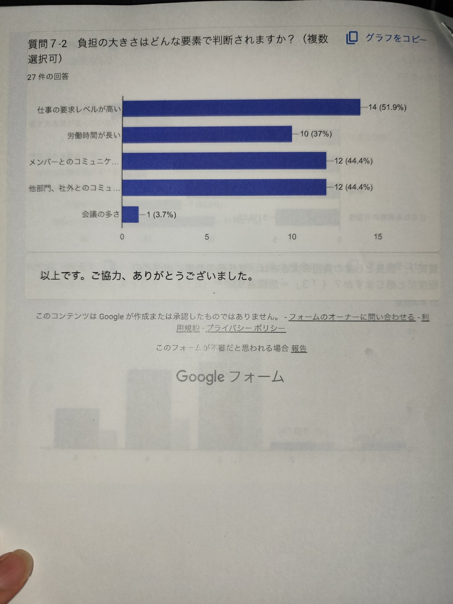

# 課長研修（中産連 第120回）レポート
## 2日間、他社の課長たちと机を並べて

---

## 研修概要

| 項目 | 内容 |
|---|---|
| 研修名 | 第120回 課長研修（全4回シリーズ、今回は1・2回目） |
| 主催 | 一般社団法人 中部産業連盟（中産連） |
| 日程 | 2026年7月22日（水）・23日（木） |
| 会場 | 名古屋市内［中産連の研修施設。正式名称は要確認］ |
| 参加者 | 廣田 和久（技術部 開発課 課長） |
| 同期の顔ぶれ | 製造業中心の中小企業約27社の課長・管理職クラス（金属加工、電子部品、自動車部品、産業機械など） |

研修は4部構成。①課長の役割（管理者の役割・自身の棚卸し）、②戦略リーダー編（方針管理・戦略策定基礎・法令遵守）、③育成リーダー編（部下育成・人事評価面談・OJT計画）、④完遂リーダー編（業務効率化・部下フォロー・決意表明）と積み上がっていく設計で、各回の間に宿題が挟まる。今回の2日間は①と②にあたる。残る③④は次回以降。

 

研修中に配布されたアンケート（Googleフォーム、参加27名回答）の集計結果。回答者の職種は開発・生産技術33.3%、製造・生産管理40.7%と、現場に近い課長が多数派だった。

---

## サマリー

日程を1日勘違いして途中参加するという失態から始まった2日間だったが、それも込みで得るものは大きかった。核心は、管理と実務のウエイトが逆転できていない自覚、フレームワーク（アンゾフ・ポーター・SWOT）を「知っている」から「本質を突いて使える」へ引き上げる必要性、そして異業種の課長たちとのディスカッションが持つ壁打ち効果の3点。座学で終わらせず、社内に持ち帰って実務に落とすところまでが研修だと肝に銘じた。

---

## 1日目（7/22）：遅刻からのリカバリー

正直に書く。日付を間違えて、３部構成のうち２番目からの途中参加になった。自己管理の甘さが招いたミスである。お詫びを伝えると、講師は休憩中にもかかわらず午前の講義内容を丁寧に教えてくれた。ありがたい話だ。

今回の研修参加の経緯にも触れておきたい。技術部内での部下育成の甘さ、GMとして必要な役割意識の甘さについて山崎部長から指摘があり、社内だけでは変化が起きにくいだろうということで、社長の後押しも受けて外部研修の場を紹介してもらった。他社の参加者の考えやレベルに触れる視点、自身の棚卸しという見方を持って臨むようにとのアドバイスも受けての参加である。

途中参加のため一言自己紹介の場をもらい、簡単な会社説明と、部下育成・組織運営という現状の課題認識を話した。午前の悩ましい感情を引きずったままの発言だったせいか、講師からは「一番リアリティのある参加者」と言われた。同じグループのメンバーはほとんどが中小製造業。「スギヤス」と名乗っただけで「ビシャモンさんですね」と数人に返され、地元製造業への浸透を感じる場面もあった。

昼休憩に慌てて名刺交換をしたところ、他のメンバーは誰とも交換していなかったとのことで驚いた。こういう小さな差が、日頃の姿勢を映す。

講義はドラッカーのマネジメント論（5つの役割）を軸に、カッツモデルの3スキル、両利きの経営、指示型・民主型リーダーシップなどを扱う内容だった。最近似た話を聞く機会が増えている分、聞いて終わりにせず、組織へ展開できるレベルまで理解を体系化したい。

グループワークで印象的だったのは、管理と実務のウエイトの話。管理中心にシフトできている人と、実務のスパイラルから抜け出せない人がはっきり分かれた。正直、自分はどこまでが管理でどこからが実務か、線引きができていない自覚を持った。管理ウエイトを高くシフトできたという参加者に聞くと、任せられるまでは半年程度テーマ別に張り付いて徹底的に教え、その後は一発勝負にならないようリハーサルを徹底しているとのこと。社長・山崎部長から教わっていることと重なるヒントに思えたが、実践できていないのが実情だ。

異なる会社のメンバーで意見を出し合うと、個人でメモしていたレベルより仕上がりが明らかに上がることも実感した。アイデア出しや問題解決を個人の合算でなくチームで取り組むことは、すぐにでも実践できる。

---

## 2日目（7/23）：戦略策定と方針管理、法令遵守

2日目は、前日の宿題だった自身の棚卸し、戦略策定と方針管理、法令遵守がテーマ。中心は方針管理のための7つのフレームワーク活用で、座学とグループワークが交互に進む。

アンゾフのマトリクスやポーターのポジショニング戦略は開発ミーティングでも耳にしたことがあり、初見ではない分、抵抗なく聞けた。ただし実務で使えるレベルには届いておらず、復習が必要というのが率直なところ。講師が繰り返し強調していたのは、フレーム活用そのものを目的化しないこと。表面でなく本質を探る姿勢が要る、という指摘は重く受け止めたい。

課長職としての棚卸しでは、全体集計を基にディスカッションを行った。多くのメンバーが「本来は管理者としての役割を果たすべき」としながら実務ウエイトが高いという現実があり、一方でやりがいや満足感はそこにあるという結果には違和感も残った。ここが共通の課題だと感じる。

宿題だったSWOT分析のグループワークでは、各社「強み」と思っていたことが実は強みでなかったり、逆に自社では気づいていなかった強みが見つかったりと、異なるメンバーで議論する意義を実感した。

意見を出せるレベル、まとめて言語化できるレベル、的確に伝えられるレベル。グループワークの中でこの3段階の差を痛感し、自分の不足を突きつけられた。上司役・部下役に分かれて指示伝達をゲーム形式で行う演習でも、曖昧すぎず実務に踏み込みすぎず、求めることを明確に伝える難しさを再認識した。

 

左：理想の管理業務比率は「70%」が33.3%で最多。現状より大きく管理側に寄せたいのが本音らしい。右：管理業務で増やしたいものは「人材育成」が92.6%で頭ひとつ抜ける。

3・4回目は人材育成が中心になるが、「人を育てる」より先に「育てられる自分」を作る必要があると感じるモヤモヤも正直ある。まずはこの2日間の振り返りを実務に落としながら、次回への準備を整えたい。

---

## アンケートで見える27人の本音

研修中に配布されたアンケート（27名回答）の集計は、自分だけの感覚ではないことを裏付けてくれた。

 

実務を減らす方法は「部下へ移管」92.6%・「効率化・標準化」85.2%が突出。一方、部門の業務課題では「実務が属人化し標準化されていない」70.4%、「管理職の役割ごとの役割が不明確」59.3%が上位に来る。方向は分かっていても、そこに至る型がまだない、という状態が透けて見える。

 

人材の課題は「人材育成が不十分」92.6%、「管理者の後継者が育っていない」70.4%が突出。課長の魅力度は「3＝想像通り」が63%で最多、期待値と現実のギャップは意外と小さいらしい。

 

魅力の中身は「やりがい」66.7%が最多。一方で負担の大きさは「就任前の想像より大きい（4・5）」が計55.5%と半数を超えた。やりがいと重さは、セットでやってくるということだろう。

 

負担の要因は「仕事の要求レベルが高い」51.9%が最多。社外とのコミュニケーション・メンバーとのコミュニケーションもそれぞれ44.4%で、板挟みの構造がそのまま数字に出ている。

---

## 印象に残った言葉

「一番リアリティのある参加者」——途中参加で悩ましい感情のまま自己紹介した廣田に、講師がかけた言葉。

「フレーム活用自体を目的化しない。表面でなく本質を探ることが必要」——講師が繰り返し強調していた戦略フレームワークの使い方に関する指摘。

---

## 所感・気づき・アクション

2日間の研修は「座学で終わり」ではない。社内に持ち帰り、実務適用するところまでが研修だ。この2日間で明確になった共通課題は3つ。

1. **管理:実務の比率逆転** — 管理者としての発信時間を、意図的に捻出する
2. **言語化力・伝達力・発信力の強化** — 人を育てる前に、まず自分がそこを一段上げる
3. **異業種ディスカッションの社内導入** — 社外の壁打ち場を、社内の仕組みとして持ち込む

戦略フレーム（アンゾフ・ポーター・SWOTなど）は既に種まき済みの道具だが、「使えるレベル」ではなく「本質を探って伝えるレベル」へ引き上げる覚悟がいる。残り2回は人材育成が中心になるが、「人を育てる自分」の前に「まず自分の言語化・伝達・発信力を磨く自分」が先だと判断し、そこに時間を投資すると決めた。

日付を間違えて途中参加するという失態も含め、包み隠さず書いた2日間だった。次回はまず、遅刻せずに行く。
