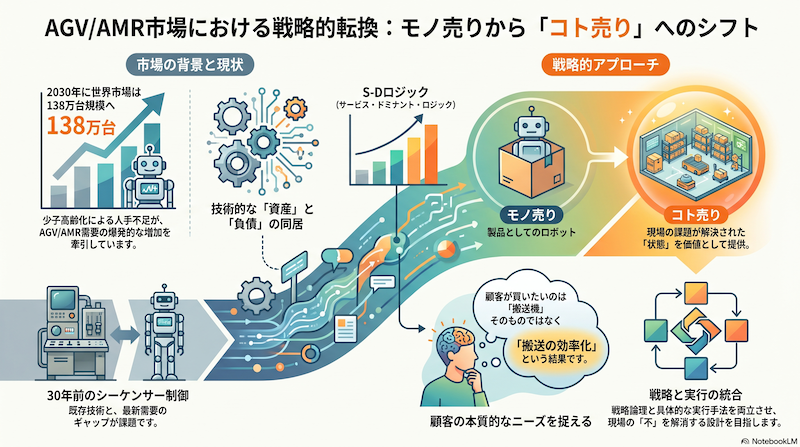
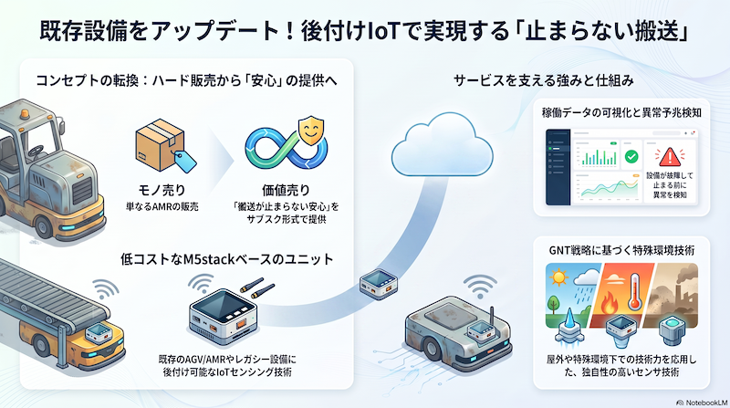

# AGV/AMR新商品開発アイデア・プレゼンテーション

株式会社スギヤス 技術部　山崎 晶洋

---

## 1. 状況整理 ― なぜ今、AGV/AMRで「新しい一手」が必要か

### 1-1. 市場の追い風

AGV/AMR市場は少子高齢化による人手不足を背景に、2030年には世界市場が約138万台まで拡大すると予測されている。
一方でスギヤスの既存ラインは約30年前のシーケンサーベース制御が中心であり、技術的な「資産」と「負債」が同居している状態。

### 1-2. 戦略レイヤーの確認

今回の提案は「戦略（Strategy & Logic）」と「実行（Execution & Methodology）」の両層にまたがる。
モノとしてのAGV/AMRを売るのではなく、**S-Dロジック（モノ売りからコト売りへ）**の発想で、顧客が本当に買いたいのは「搬送する穴」ではなく「現場の不を解消した状態」であることを起点に設計する。

 

AGV/AMR市場における戦略的転換：モノ売りからコト売りへのヒント。

### 1-3. 黄金律との整合確認

顧客の「不」を解消する使用価値の提供を起点とし、現場第一主義のKPIに基づくアジャイルなスモールスタートを貫くことで、補助金に依存しない自走可能なリカーリング・ビジネスを構築せよ。

今回の新商品アイデアは、この黄金律に沿って「補助金ありき」ではなく、現場の「不」起点・スモールスタート・リカーリング収益の3点を満たす設計とする。

---

## 2. 推奨アプローチ ― 新商品アイデア「AMR見守りIoTユニット（仮称）」

### 2-1. コンセプト

既存AGV/AMR、さらには稼働中のレガシー搬送設備に後付けできるM5stackベースの低コストIoTセンシングユニットを開発し、稼働データの可視化と異常予兆検知をサブスクリプション型で提供する。

「AMR本体を売る」のではなく、「搬送が止まらない安心を売る」── これがGNT（グローバルニッチトップ）戦略における"屋外用センサ・特殊環境下の技術力"という強みの応用形である。

 

既存設備をアップデート。後付けIoTで実現する「止まらない搬送」のコンセプト。

### 2-2. 「不」の深掘り（国語・算数・理科・社会の視点）

| 視点 | 現場の「不」 |
|---|---|
| 国語（言葉にならない不満） | 「なんとなく最近、台車が引っかかる気がする」という感覚的な訴え |
| 算数（数値化されていない不便） | 停止時間・バッテリー劣化率・走行距離あたりの故障率が記録されていない |
| 理科（技術的な不足） | 30年前のシーケンサー制御機にはIoT通信機能が存在しない |
| 社会（組織的な不足） | 保全担当のベテランの勘に頼った点検サイクルになっている |

### 2-3. なぜAMR本体ではなく「センシングユニット」から始めるのか

高速PoCの原則に従い、自社AMR本体の新規開発（大きな投資）ではなく、既存設備に後付け可能な小さなユニットからスタートすることで、技術的実現可能性と顧客受容性を早期に検証できる。
検査工程やメンテナンス部門など限定領域からのアジャイルなスモールスタートが可能であり、全社一斉導入のリスクを避けられる。

### 2-4. リカーリング設計

| フェーズ | 収益モデル |
|---|---|
| 初期導入 | ユニット本体販売（低マージンでも可） |
| 月額提供 | 稼働データダッシュボード利用料（XaaS） |
| 継続収益 | 異常予兆アラートに基づく予防保全契約・部品先回り提案 |

限界費用ゼロ社会の発想により、データダッシュボード部分は損益分岐点を超えれば追加コストがほぼ発生せず、利益率を押し上げる構造にできる。

### 2-5. 技術構成（たたき台）

- センサー：振動・電流・温度（既存M5stack開発資産を活用可能）
- 通信：LTE-M or Wi-Fi（工場内Wi-Fi環境に依存しない設計を推奨）
- データ基盤：クラウドダッシュボード（異常予兆は閾値検知から段階的にAI化）
- 要件定義：全体工数の1/3〜1/2を要件定義に配分し、既存システム分析は軽めに留め、現場の業務フロー可視化からやり直す

### 2-6. 現場視点KPI（最重要指標）

「コンマ一秒でも業務が遅くなってはならない」という原則のもと、以下を評価軸とする。

- 取り付け作業が現場の通常メンテナンス時間内で完結するか
- アラート発報から現場が次にとる行動が1アクションで完結するか
- ダッシュボード閲覧が現場のITリテラシーに依存しないUIか

---

## 3. リスクと代替案

| 想定されるリスク | 指摘 | 代替案 |
|---|---|---|
| 「ものづくり補助金」獲得を前提に投資判断をしてしまう | 補助金依存の場合、数ヶ月で稼働停止・アナログ回帰する事例が多い | 補助金なしでも成立する真のROI（保全コスト削減額×台数）を先に試算し、その上で活用できる補助金があれば併用する程度に留める |
| ベテラン保全担当の「勘」をそのままシステムのしきい値に転用しようとする | ブラックボックス化により技術承継に失敗するリスク | 熟練担当者へのヒアリングで異常判断の基準を形式知化し、データとして閾値設計に落とし込むプロセスを必須工程とする |
| いきなり全工場・全AMRへの一斉導入を計画する | 現場の抵抗感が強く失敗しやすい | まず特定の検査工程・特定の搬送ラインの1〜2台に限定し、成功体験を社内に広げる |
| 現場ヒアリングのみでボトムアップにPoCを進めようとする | 経営層のコミットがないと「PoC沼」に陥り事業構想に繋がらない | 取締役会レベルでの予算・権限付与と、失敗を許容する文化醸成をセットで進める（山崎様ご自身が取締役部長であることが強みになる） |

---

## 4. 次の一歩（具体的アクション）

- **対象選定（1週間以内）**：社内の既存AGV/AMRまたはレガシー搬送設備の中から、PoC対象を1〜2台に限定して選定する。
- **「不」のヒアリング（2週間以内）**：保全担当者・現場オペレーターへの聞き取りを行い、異常判断の暗黙知を言語化する。
- **M5stack試作（1ヶ月以内）**：振動・電流センサーを用いた最小構成のプロトタイプを社内で組み立て、データ取得を開始する。
- **要件定義の本格着手（試作と並行）**：全体スケジュールの1/3〜1/2を要件定義に充て、業務フロー可視化から着手する。
- **社内向け一燈会／経営層への中間報告**：取締役部長としての権限を活かし、PoC沼化を防ぐための経営コミットメントを早期に取り付ける。

---

## 所感

正直に言えば、AGV/AMR本体そのもので勝負するのは、すでにレッドオーシャン気味です。138万台という市場予測の数字に踊らされて「うちもAMRを作るぞ」と本体勝負に出るのは、典型的な失敗パターンに近づくリスクがあると感じています。

むしろスギヤスの強みは、30年選手のレガシー設備が現場に大量に残っていること、そしてその「不」を一番よく知っているのが自分たち自身であることです。M5stackでサクッと作れる規模感のセンシングユニットなら、開発部門の手の内でPoCを回せますし、補助金が取れなくても自走できるROIを最初から設計できます。

経営判断としては、「AMR本体の新規開発」よりも先に、「既存資産＋IoTでリカーリング収益を作る」方を小さく試す方が、リスクとリターンのバランスが良いと考えます。
