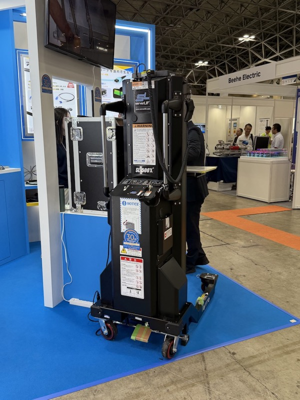
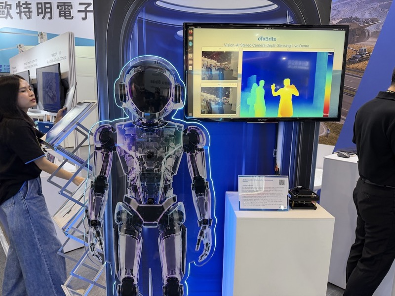
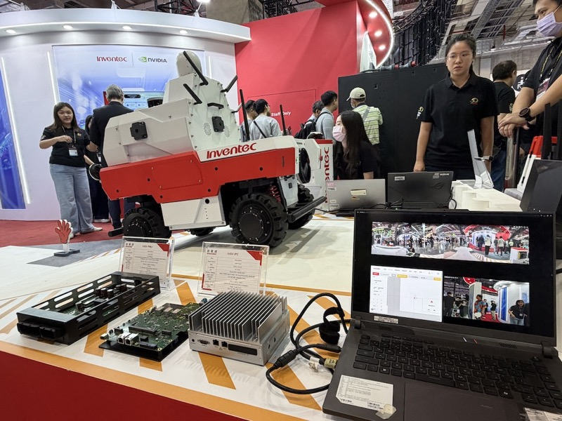
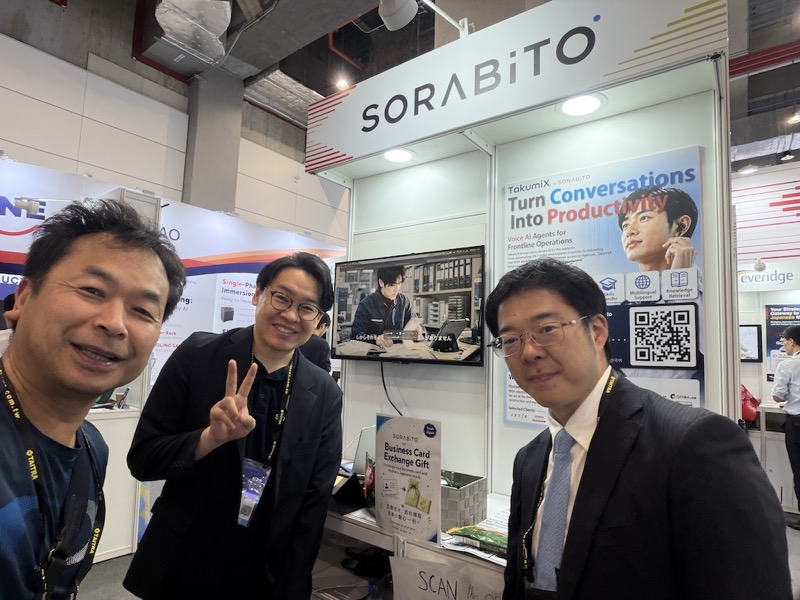
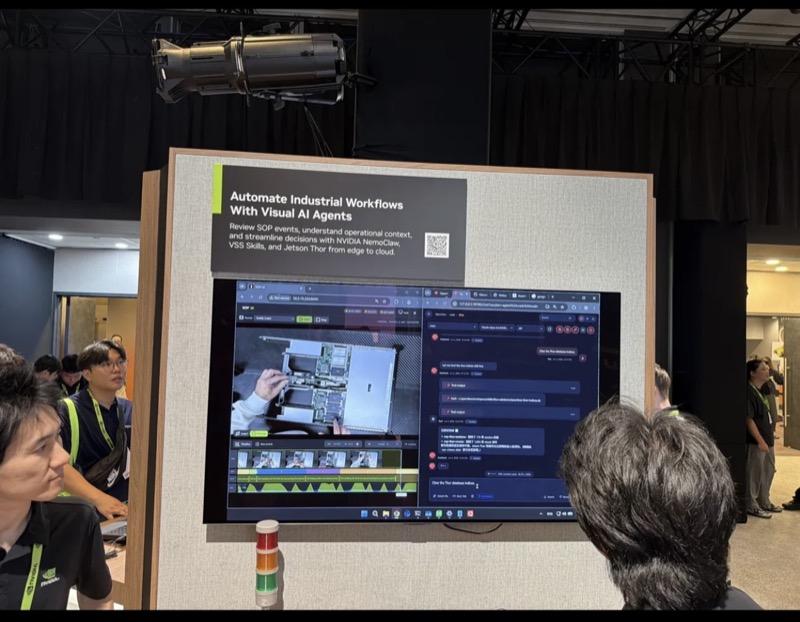

# スギヤス 新商品開発分野提言 2026

> 作成：2026年6月
> 出典：MODEX2026（アトランタ）、LogiMAT2025（シュトゥットガルト）、Electric China 2025（上海）、欧州訪問（MANUVIT／IMS）、Computex2026（台北）、Interop Tokyo 2026（幕張）、Robot Technology Japan 2026（愛知）の全視察報告より統合

---

## 前提：視察全体から見えた共通の構造変化

2025〜2026年にわたる7つの展示会・出張から、以下の構造変化が明確に読み取れる。

| 構造変化 | 主な根拠展示会 |
|---|---|
| LiDARからカメラ＋Vision AIへの移行 | Computex oToBrite・Inventec iUGV、MODEX AMR群 |
| NVIDIA Jetsonがエッジロボットのデファクト標準に | MODEX・Computex・Interop 各所で共通言及 |
| AMR/AGVはハード競争からAIプラットフォーム競争へ | RTJ26（差別化困難な箱型AMR）、LogiMAT（自律フォーク・マニピュレーター付AMR） |
| データセンターの「物理層」が急成長ニッチ | Interop ALPSystems serverLIFT・液浸冷却各社 |
| 現場の「見えないもの」をAIで可視化する流れ | Computex（Olive感情可視化・SORABITO TakumiX・NVIDIA Visual AI） |
| 点検・保守のデジタル化が商機 | SORABITO フォークリフト年次点検デジタル化・行政認可取得 |

スギヤスの主戦場（リフト・フォークリフト・AGV/AMR）は、ハード単体の性能競争から**「センシング×AI」「デジタル保守」「現場ハードへのAI実装」**が重なる新しい競争軸に移行しつつある。以下、その重なりにスギヤスの現場対応力を掛け合わせられる、最も優先度の高い3分野を提言する。

---

## 分野1：データセンター専用サーバーリフト

 

Interop Tokyo 2026のALPSystemsブースにて撮影。serverLIFT「SL-500X」実機。サーバー機器をラックへ安全に昇降・搬送する専用機で、現時点で国内市場は輸入品1社が独占している。

### 何を作るか

AI/GPUサーバー（重量100〜300kg超）を安全にラックへ昇降・搬送するための、**クリーン度・静電気・耐荷重要件を満たした専用リフト**。ALPSystems（米）の「serverLIFT SL-500X」に相当するが、**国産・短納期・自社サービス付き**を差別化軸とする日本初の専用機。

### 根拠・理由

#### 現状の市場空白

Interop Tokyo 2026でALPSystems（米）のserverLIFT SL-500Xを現地で調査した。

- **価格**：軽自動車を軽く上回る（100〜150万円帯と推測）
- **販売台数**：年間20台（日本国内）
- **納期**：半年以上（アメリカ製のため）
- **販売開始**：約10年前から。しかし「ここ最近になってたくさん売れるようになった」

つまり、現時点で競合は**輸入品1社が独占**。国産品は存在しない。導入障壁として「納期の長さ」と「アフターサービスの不安」が残っており、ここにスギヤスが入れる。

#### 需要を支える構造的要因

Computex2026でNVIDIA Jensen Huang氏の基調講演と同社GTC展示を視察。「数年前比で桁違いのAI計算能力需要」「GPU供給が市場成長を左右する状況」「ソフト開発全工程をAIが担う未来の経済インパクトは数千億ドル」という言及があった。

これに対応するAI/GPUデータセンターの新設ラッシュは、国内外で加速している。サーバーラックの高密度化に伴い**1ラックあたりの機器重量も増加**しており、手作業での設置が危険になってきている。serverLIFTの需要は構造的・長期的に増える。

#### スギヤスが取り組める技術的根拠

- **リフト設計ノウハウ**：シザーリフト・テーブルリフト・垂直リフトの設計・生産実績がある。
- **清潔対応**：電動走行系（EP・トラバー系）で既にクリーン対応の知見がある。
- **スーパーニッチでのNo.1**：橋本GMの着眼通り、「特殊仕様の専用機」でNo.1を取りに行くアプローチはスギヤスの過去のヒット商品と同じ文脈に乗る。
- **サービス網**：国産であることで、国内の迅速なアフターサービスが付加価値になる。

---

### 市場成長性予測

| 指標 | 内容 |
|---|---|
| 国内DCサーバーリフト市場（現状） | 推計：年間20台規模（ALPSystems 1社独占） |
| 5年後の推計需要 | AI/GPU投資の加速により**年間50〜100台規模**へ拡大の見込み |
| 世界DCサーバーリフト市場 | 2024年約3億ドル → 2030年7〜10億ドル（CAGR 15〜20%）と推計 |
| 国内DC投資額 | 政府・民間のGX・AI戦略でデータセンターへの投資は今後5年で累計10兆円規模 |

**スギヤスの参入機会**：現状年間20台・1社独占の市場に国産品を投入すれば、「短納期・国産アフターサービス付き」だけで初年度から5〜10台程度の受注が見込める。3年後には年間20台規模（国内シェア30〜50%）が現実的な目標ラインとなる。DCサーバーリフトは一度導入されると同一ベンダーへのリピートが高いため、早期参入が重要。

---

## 分野2：カメラ×Vision AI搭載次世代AMR/AGV（脱LiDAR型）

 

左：Computex2026 oToBriteブース。ステレオカメラで人の動きを3D深度マップとして可視化するデモ。右：Inventec×NVIDIAが共同開発した自律AMR「iUGV」。手前のモジュール群がNVIDIA Jetson AGX OrinベースのエッジAIコンピューティング部。

### 何を作るか

従来のLiDAR前提を外し、**ステレオカメラ＋Vision AI（SLAM）＋NVIDIA Jetsonをコアとした自律搬送機**。「LiDARを使わない」を訴求軸にしたコスト競争力と差別化メッセージを持つ、スギヤス次世代AMR/AGV。

### 根拠・理由

#### LiDARからカメラへ：技術的転換点

Computex2026で台湾の車載カメラメーカー・oToBriteを視察。**「ステレオカメラ＋Vision AIはLiDARより高精度」**という主張は誇張ではなく、以下の理由で技術的に裏付けられる。

- LiDARは「点群（Point Cloud）」データで解像度に上限がある（128chでも1m先で数cm間隔）。
- ステレオカメラ+AIは**ピクセル単位の奥行き情報**を得られ、低テクスチャ面をAI補完できる。
- コストはLiDARの**1/10〜1/100**。エッジAIチップで処理可能。
- テスラ自動運転もカメラベースでLiDARを廃止する方向性に舵を切っている。

#### NVIDIA Jetsonがデファクト標準

MODEX2026（アトランタ）で「AMRが人混みの中を自律走行」するデモを複数視察。Computex2026のInventec iUGVでその答えが明確になった。

- **NVIDIA Orin NX（157 TOPS）**：多くのAMRメーカーがこのシリーズを搭載。
- **cuVSLAM**（GPU加速SLAM）：カメラ映像だけで精度の高い位置推定を実現。
- **NVIDIA Isaac プラットフォーム**：同じ基盤を使う他社システムとの連携が容易。

LogiMAT2025では既にAMR市場が「どのAMRを選ぶか」という選択の段階に入っており（欧州）、日本市場もRTJ2026でオムロン（1,400万円・2台販売）が示す通り、まだ普及黎明期。

#### スギヤスが取り組める根拠

- **水野の研究**：既にNVIDIA Jetson AGX Orinを使った「ヒト検出カメラ装置」を研究中。同じ技術スタックの延長線上にある。
- **DMP・IDECとのコラボ**：AMR開発の実績・パートナー関係が既にある。
- **Inventecへのコンタクト**：Computex視察後、来週中にメールコンタクト予定（山崎）。技術提携の可能性を検証できる段階にある。
- **欧州OEM**：MANUVIT/IMSとのOEM協議も並行して進行中。
- **「LiDARを使わない」という訴求軸**：製品カタログに一言書くだけでインパクトが大きい（山崎コメント）。

---

### 市場成長性予測

| 指標 | 内容 |
|---|---|
| 世界AMR市場規模（2024） | 約38億ドル |
| 世界AMR市場規模（2030予測） | 約130〜150億ドル（CAGR 約20〜22%） |
| 国内AMR市場規模（2024） | 約800億円 |
| 国内AMR市場規模（2030予測） | 約2,000〜2,500億円（CAGR 約17〜20%） |
| カメラ主体AMRのコスト優位 | LiDARコスト（数万〜数十万円/台）をゼロ化 → 本体価格を20〜30%下げられる可能性 |

**スギヤスの参入機会**：RTJ2026での現地調査が示す通り「導入ハードルの低さ・既存設備との親和性」が日本市場のカギ。スギヤスの現場対応力×カメラAMRのコスト優位の組み合わせは、「高い・難しい」というAMRへの先入観を崩す最有力手段になる。カメラ+AI型AMRが普及期に入る2〜3年後に先行者として立ち回るためには、**今すぐPoCを完了させること**が最優先課題。

---

## 分野3：フォークリフト・リフト向け 点検デジタル化 × 現場AI監視 セット提案

 

左：Computex2026 日本パビリオンのSORABITOブース。フォークリフト年次点検を行政認可済みでWeb完結させる「TakumiX」を展示。右：NVIDIA「Automate Industrial Workflows With Visual AI Agents」。カメラ映像からSOP逸脱をリアルタイム検知するシステム。

### 何を作るか

スギヤスのリフト・フォークリフト本体に、**①フォークリフト年次点検のデジタル化オプション（SORABITO TakumiX連携）** と **②現場作業者・機械の状態をAIカメラで可視化するセンシングオプション（NVIDIA Visual AI）** を組み込み、**「ハード＋デジタルサービス」のセット提案**に転換する。

### 根拠・理由

#### SORABITO TakumiX：フォークリフト点検の行政認可済みデジタル化

Computex2026の日本パビリオンでSORABITOを視察し、意気投合・後日打合せ約束済み。

- フォークリフトの**年次点検をWebシステム上で完結**できる仕組みを開発。
- **日本で初めて行政認可を取得**（約3年の取り組みの末）。
- 創業者は40歳・半田市出身。スギヤスとの地縁・文化的親和性も高い。
- スギヤスのEP・トラバー電動走行タイプを「対象車両」に加えてもらえないか、とアプローチを受けている。

現状は紙で行われる点検記録をデジタル化し、クラウドで管理する。管理者・顧客への証跡提供、AIによる劣化予測への展開も可能。

#### NVIDIA Visual AI：現場の「見えないもの」を可視化

Computex2026のNVIDIA TICCショーケースで「Automate Industrial Workflows With Visual AI Agents」を視察。

- カメラ映像から**SOP（標準作業手順）の逸脱をリアルタイム検知**するシステム。
- NVIDIA NemoClaw・VSS Skills・Jetson Thorの組み合わせ。
- 水野が研究中の「ヒト検出カメラ装置」（NVIDIA Jetson使用）は**同じ技術スタックの延長線上**にある。

さらにComputex日本パビリオンのOlive（名古屋本社登記）は、カメラで静脈を検出して**感情をリアルタイムモニタリング**する技術を持つ（起源はトヨタの乗り心地開発）。リフト・製造ラインの操作者の疲労・緊張状態を数値化できれば、安全性と生産性のKPI化につながる。

#### なぜスギヤスがやるべきか

- **本業のフォークリフト・リフト**を売り切りではなく**継続的な収益源（サービス）**に転換できる。
- 点検デジタル化は「ハードを売る会社がやるから意味がある」——SORABITOはスキャナー・装置を売る会社ではないため、ハードとセットにする価値がある。
- 競合の中国メーカー（EP・HUAGANG・STAXX等）はLogiMAT2025での視察通り、ハードの価格競争では脅威になっている。一方「現場の状態を見せる」サービスは、長い顧客関係と現場知識がなければ作れない。スギヤスの強みが活きる。
- DMP×STARBITの「AI動画改ざん防止エンジン」を、リフトの安全検査記録・工場内監視映像の**証跡管理**に応用する展開も可能（Computex2026で浜中さんとの情報交換済み）。

---

### 市場成長性予測

| 指標 | 内容 |
|---|---|
| 国内フォークリフト年次点検対象台数 | 約80万台（稼働中のフォークリフト） |
| フォークリフト点検デジタル化のSaaS市場 | 2026年〜立ち上がり期。3年後に数十億円規模が見込まれる |
| 製造現場向けAI監視システム市場（国内） | 2024年約500億円 → 2029年約2,000億円（CAGR 約30%）推計 |
| スマートファクトリー関連市場（国内） | 2024年約1.5兆円 → 2029年約3兆円 |
| ハード＋SaaS型ビジネスの利益率 | 単体ハード販売（利益率15〜25%）からSaaS収益付加で**利益率40〜60%相当**に転換可能 |

**スギヤスの参入機会**：SORABITOとの提携は「行政認可済みの仕組み」をすぐに使えるという意味で、スギヤスが一から開発する必要がない点が大きい。**「EP/トラバー購入時の標準オプション」にしてしまえば、年間数百台規模の自動的な導入サイクルが生まれる。** 3年以内に実現できれば、継続課金型の新収益柱として確立できる。

---

## 3分野の優先順位と時間軸

| 優先度 | 分野 | 短期アクション（〜1年） | 中期目標（3年） |
|---|---|---|---|
| **最優先** | ③ 点検デジタル化×現場AI監視 | SORABITOとの提携合意・EP対象化の検証 | EP/トラバー標準オプション化・年間200台以上の搭載 |
| **高** | ② 脱LiDAR型AMR/AGV | Inventecとのメールコンタクト→技術提携検証。水野の研究とroboflow連携でパレット認識PoC完了 | 脱LiDAR試作AMR完成・国内展示会出展 |
| **中（中期柱）** | ① DC専用サーバーリフト | ALPSystems競合分析・要求スペック整理・試作計画策定 | 試作機完成・国内DCに先行納入・量産開始 |

---

## 結論

3分野に共通するのは「スギヤスの**現場対応力・ハード設計力**」と「**AI・デジタル技術**」の掛け合わせである。中国メーカーがハードの価格競争を制圧しつつある中、スギヤスが生き残るシナリオは「**現場に根差したデジタルサービスとセットにしたハード提供者**」への転換以外にない、と今次の全視察は示している。

3分野のいずれも、**既にコンタクト済みのパートナー（SORABITO、Inventec、DMP、MANUVIT/IMS）が存在する**。新規の市場開拓ではなく、現在の出会いを早期に形にすることが最重要課題である。

---

*本提言書は各出張報告（LogiMAT2025/Report.md・Report_USA.md・Report_EURO.md・2025ElectricChina/Report.md・Coputex2026-Report.md・Interop26-Report.md・RobotTechnologyJapan2606-Report.md）および中期商品開発戦略_Draft.md の全情報を基に、Claude（AI）が統合・整理したものです。内容の見直し・追記を歓迎します。*
